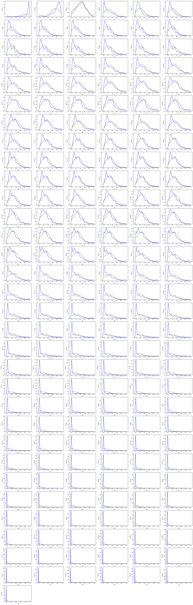
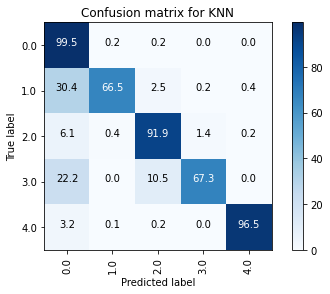
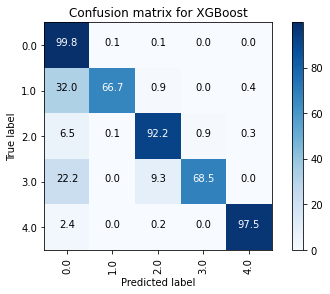
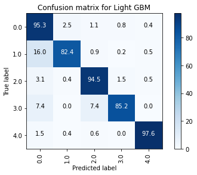
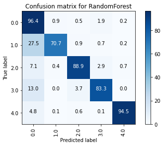

# Contents

__[1. Dataset](#DATASET)__  

__[2. Exploratory data analysis  ](#EXPLORATORY-DATA-ANALYSIS)__  

__[3. Model Selection](#MODEL-SELECTION)__  
    [3.1. Individual machine learning models](#Individual-machine-learning-models)  
    [3.1.1. K-Nearest Neighbors](#K-Nearest-Neighbors)  
    [3.1.2. SVM](#SVM)  
    [3.2. Ensembles and boosting](#Ensembles-and-boosting)  
    [3.2.1. XGBoost](#XGBoost)  
    [3.2.2. Gradient boosting](#Gradient-boosting)  
    [3.2.3. LightGBM](#LightGBM)  
    [3.2.4. AdaBoost](#AdaBoost)  
    [3.2.5. Random forests](#Random-forests)  
    
__[⁽ⁿᵉʷ⁾4. Resampling](#Resamling)__  

__[5. Results](#Summary-of-the-results)__  

__[6. TO DO](#TODO)__  


```python
import numpy as np 
import pandas as pd 

import random
import itertools
from importlib import reload
from datetime import datetime

import matplotlib.pyplot as plt

from sklearn.pipeline import Pipeline
from sklearn.model_selection import train_test_split, GridSearchCV, RandomizedSearchCV

from sklearn.svm import SVC
from sklearn.ensemble import RandomForestClassifier

from sklearn import metrics
from sklearn.metrics import jaccard_score
from sklearn.metrics import f1_score
from sklearn.metrics import log_loss

# my packages
import tools as t
```

# DATASET  

The dataset is the MIT-BIH Arrhythmia Dataset:  
https://www.kaggle.com/gregoiredc/arrhythmia-on-ecg-classification-using-cnn  
https://archive.physionet.org/physiobank/database/html/mitdbdir/intro.htm

- Number of Samples: 109446
- Number of Categories: 5
- Sampling Frequency: 125Hz
- Data Source: Physionet's MIT-BIH Arrhythmia Dataset
- Classes: ['N': 0, 'S': 1, 'V': 2, 'F': 3, 'Q': 4]  
(N - Normal beat, S - Supraventricular premature beat, V - Premature ventricular contraction, F - Fusion of ventricular and normal beat, Q - Unclassifiable beat)

Each row is one beat taken from the original source (represents 10 seconds of data)

__Task:__ multiclass classification


```python
import os
for dirname, _, filenames in os.walk('/data'):
    for filename in filenames:
        print(os.path.join(dirname, filename))

        
# mitbih data
df_train = pd.read_csv('data/mitbih_train.csv', header=None)
df_test = pd.read_csv('data/mitbih_test.csv', header=None)

# combined df
train = df_train.rename(columns={187:'y'})
test = df_test.rename(columns={187:'y'})

# training data
X_train = train[train.columns[:-1]]
y_train = train[train.columns[-1]]

# testing data
X_test = test[test.columns[:-1]]
y_test = test[test.columns[-1]]
```

__[top](#Contents)__  

# EXPLORATORY DATA ANALYSIS

- The observations are skewed.
- Normal heartbeat is the most popular class. Deviations from this class are scarce, especially for class 1 (S - Supraventricular premature beat) and 3 (F - Fusion of ventricular and normal beat) and require more attention.


```python
from tools.preprocessing import eda

cls_df = eda.Dataset(X_train)
# cls_df.get_overview()
```


```python
from tools.preprocessing import eda

cls_df = eda.Dataset(train)
train = cls_df.get_randomdata(n=10000)

# training data
X_train = train[train.columns[:-1]]
y_train = train[train.columns[-1]]

```


```python
reload(eda)
cls_df = eda.Dataset(X_train)
cls_df.get_summary(y=y_train,
    nan=True,
    formats=True,
    categorical=True,
    min_less_0=True,
    class_counts=True,
    check_normdist=True,
    plot_boxplots=False)
```

    NaNs:  []
    Unique formats:  [dtype('float64')]
    Possible categorical variables (<10 unique values):  []
    Min value < 0:  []
    Observations per class:
    0    72471
    1     2223
    2     5788
    3      641
    4     6431
    Name: y, dtype: int64
    Plotting distributions of variables against normal distribution
    
   


    

    


### Observations per class


```python
labels = ['0 (N - Normal beat)',
          '1 (S - Supraventricular premature beat)',
          '2 (V - Premature ventricular contraction)',
          '3 (F - Fusion of ventricular and normal beat)',
          '4 (Q - Unclassifiable beat)']
 
plt.figure(figsize=(10, 7))
plt.pie(y_train.astype(int).value_counts().sort_index(), labels=labels, autopct='%1.1f%%', pctdistance=1.1, labeldistance=1.3)
plt.title('Observations per class')
plt.legend( bbox_to_anchor=(2, 1), loc='upper right')
plt.show()
```


    

    


### Examples from different classes


```python
# sample one observation
r_sample = df_train.groupby(187, group_keys=False).apply(lambda train_df: train_df.sample(1, random_state=42))

# plot 
fig, axes = plt.subplots(5, 1, figsize=(16, 11))
leg = iter(['N - Normal beat',
 'S - Supraventricular premature beat',
 'V - Premature ventricular contraction',
 'F - Fusion of ventricular and normal beat',
 'Q - Unclassifiable beat'])
colors = iter(['skyblue', 'red', 'lightgreen', 'orange', 'black'])
for i, ax in enumerate(axes.flatten()):
    ax.plot(r_sample.iloc[i, :187], color=next(colors))
#     print(next(leg))
    ax.legend(next(leg))
plt.show()

```


    

    


__[top](#Contents)__  

# MODEL SELECTION  

__The problem__:  
Although the accuracy is pretty high (90%), recall is very low for some classes (1 (S - Supraventricular premature beat) and 3 (F - Fusion of ventricular and normal beat)). Since the dataset is unbalanced (normal beat represents the majority of the datapoints), accuracy is not a good measure for assessing model performance, because we should focus on positive cases for these classes if we wish to identify the disease. 

So, we need to improve __recall__, the ability of a model to find all relevant cases within a dataset, while keeping the precision at an appropriate level.

A __macro-average__ will compute the metric independently for each class and then take the average (hence treating all classes equally), whereas a __micro-average__ will aggregate the contributions of all classes to compute the average metric. Macro leads to a lower result since it doesn't account for the number of samples in the minority class.


```python
#train validation split
X_train, X_val, y_train, y_val = train_test_split(train.iloc[:,:-1], train.iloc[:,-1], 
                                                    test_size=0.2, random_state=42)

import multiprocessing
n_jobs=multiprocessing.cpu_count()  # 56

#my package
import tools as t
reload(t)
from tools.models import models as m

# Create the pipeline
from sklearn.preprocessing import StandardScaler

cls_models = m.Model(X_train, y_train, X_val, y_val)

```

## Individual machine learning models

- Original dataset was used (no feature selection, no sampling).
- Models which were compared: Naive Bayes, Logistic regression, SVM, kNN, Decision trees.
- Best performing models based on recall: SVM, kNN, DT.

__[top](#Contents)__  

## K-Nearest Neighbors


```python
%%time

from sklearn.neighbors import KNeighborsClassifier
name = 'KNN'
model = KNeighborsClassifier(
    n_jobs=56,
)

steps=[]

parameters = {
    'KNN__n_neighbors': np.arange(3, 8, 1),
    'KNN__weights': ['uniform', 'distance'],
    'KNN__p': [1, 2]
}


model_knn = cls_models.checkmodel(
                                    name,
                                    model,
                                    steps=steps,
                                    parameters=parameters,
                                    average='macro',
                                    multiclass=True,
                                    metric='recall',
                                    randomized_search=False,
                                    nfolds=5,
                                    n_jobs=56,
                                    verbose=1
                                    )

```

    Fitting 5 folds for each of 20 candidates, totalling 100 fits
    Mean cross-validated score of the best_estimator: 0.8466
         Parameter Tuned value
    0  n_neighbors           4
    1            p           1
    2      weights    distance
    F1-score: 0.8893
    Precision: 0.9254
    Recall: 0.8596
    Accuracy on train data: 1.0
    Accuracy on test data: 0.9769
    


    

    


    Wall time: 17min 41s
    

__[top](#Contents)__  

## SVM


```python
%%time

name = 'SVM'
model = SVC()

steps=[]

parameters = {
    'SVM__C': [1, 10, 50],
    # Regularization - tells the SVM optimization how much error is bearable
    # control the trade-off between decision boundary and misclassification term
    # smaller value => small-margin hyperplane
    # 'SVM__kernel': ['linear', 'poly', 'rbf', 'sigmoid'],  # VERY long pls don't
    # 'SVM__degree': [3],
    'SVM__gamma': [0.1, 0.5, 0.07, 'scale', 'auto'],  # scale
    'SVM__class_weight': ['balanced'],  # None
    }

model_svm = cls_models.checkmodel(
                                    name,
                                    model,
                                    steps=steps,
                                    parameters=parameters,
                                    average='macro',
                                    multiclass=True,
                                    metric='recall',
                                    randomized_search=False,
                                    nfolds=5,
                                    n_jobs=56,
                                    verbose=1
                                    )

```

    Fitting 5 folds for each of 15 candidates, totalling 75 fits
    Mean cross-validated score of the best_estimator: 0.9175
          Parameter Tuned value
    0             C           1
    1  class_weight    balanced
    2         gamma         0.5
    F1-score: 0.8157
    Precision: 0.7602
    Recall: 0.9312
    Accuracy on train data: 0.9867
    Accuracy on test data: 0.9568
    


    

    


    Wall time: 1h 24min 50s
    

__[top](#Contents)__  

## Ensembles and boosting

### XGBoost


```python
%%time

import xgboost as xgb

name = 'XGB'
model = xgb.XGBClassifier(    
    seed=42,
    verbosity=0,
    use_label_encoder=False,
    objective='multi:softmax',
    num_class=5,
#     eval_metric='mlogloss',
    eval_metric='merror',
)

steps=[]

parameters = {    
    'XGB__eta': [0.05, 0.3, 0.5],  # 0.3
    'XGB__gamma': [0, 1, 5],  # 0
    'XGB__max_depth': [3, 6, 10],  # 6
    'XGB__min_child_weight': [0.5, 1],  # 1
    'XGB__subsample': [0.7, 1],  # 1
    'XGB__sampling_method': ['uniform', 'gradient_based'],  # uniform
#     'XGB__colsample_bytree': [0.7],  # 1
    'XGB__lambda': [1],  # 1
    'XGB__alpha': [0],  # 0
    'XGB__tree_method': ['auto'],  # auto
    'XGB__scale_pos_weight': [0.3, 0.7, 1],  # 1
    'XGB__predictor': ['cpu_predictor'],  # auto
    'XGB__num_parallel_tree': [1],  # 1
}

model_xgb = cls_models.checkmodel(
                                    name,
                                    model,
                                    steps=steps,
                                    parameters=parameters,
                                    average='macro',
                                    multiclass=True,
                                    metric='recall',
                                    randomized_search=False,
                                    nfolds=5,
                                    n_jobs=56,
                                    verbose=1
                                    )

```

    Fitting 5 folds for each of 648 candidates, totalling 3240 fits
    
    

    Mean cross-validated score of the best_estimator: 0.8518
                Parameter    Tuned value
    0               alpha              0
    1                 eta            0.5
    2               gamma              0
    3              lambda              1
    4           max_depth             10
    5    min_child_weight            0.5
    6   num_parallel_tree              1
    7           predictor  cpu_predictor
    8     sampling_method        uniform
    9    scale_pos_weight            0.3
    10          subsample            0.7
    11        tree_method           auto
    F1-score: 0.9095
    Precision: 0.9625
    Recall: 0.8681
    Accuracy on train data: 1.0
    Accuracy on test data: 0.9814
    


    

    


    Wall time: 15h 27min 11s
    

__[top](#Contents)__  

### Gradient boosting


```python
%%time
from sklearn.ensemble import GradientBoostingClassifier

name='GradientBoosting'
model = GradientBoostingClassifier(random_state=42)

steps=[]

parameters = {
    'GradientBoosting__loss': ['deviance'],  # 'deviance'
    'GradientBoosting__learning_rate': [0.1, 0.5, 0.01],  # 0.1
    'GradientBoosting__n_estimators': [100, 500, 50],  # 100
    'GradientBoosting__subsample': [1, 0.5, 0.7],  # 1
    'GradientBoosting__criterion': ['friedman_mse'],  # 'friedman_mse'
    'GradientBoosting__min_samples_split': [2, 5],  # 2
    'GradientBoosting__min_samples_leaf': [1],  # 1
    'GradientBoosting__min_weight_fraction_leaf': [0],  # 0
    'GradientBoosting__max_depth': [3, 5],  # 3
    'GradientBoosting__min_impurity_decrease': [0],  # 0
#     'GradientBoosting__max_features': [None, 'auto', 'sqrt', 'log2'],  # None
    'GradientBoosting__max_leaf_nodes': [None],  # None
    'GradientBoosting__validation_fraction': [0.1],  # 0.1
    'GradientBoosting__n_iter_no_change': [5],  # 0
}

model_gb, y_pre_gb = cls_models.checkmodel(
                                    name,
                                    model,
                                    steps=steps,
                                    parameters=parameters,
                                    average='macro',
                                    multiclass=True,
                                    metric='recall',
                                    randomized_search=False,
                                    nfolds=5,
                                    n_jobs=56,
                                    verbose=1
                                    )

```

    Fitting 5 folds for each of 108 candidates, totalling 540 fits
    Mean cross-validated score of the best_estimator: 0.8
                       Parameter   Tuned value
    0                  criterion  friedman_mse
    1              learning_rate           0.1
    2                       loss      deviance
    3                  max_depth             5
    4             max_leaf_nodes          None
    5      min_impurity_decrease             0
    6           min_samples_leaf             1
    7          min_samples_split             2
    8   min_weight_fraction_leaf             0
    9               n_estimators           500
    10          n_iter_no_change             5
    11                 subsample             1
    12       validation_fraction           0.1
    F1-score: 0.8581
    Precision: 0.9073
    Recall: 0.8192
    Accuracy on train data: 0.9425
    Accuracy on test data: 0.9718
    


    

    


    Wall time: 7h 22min 49s
    

__[top](#Contents)__  

### LightGBM


```python
%%time
import lightgbm as lgb

name='LGBMClassifier'
model = lgb.LGBMClassifier(seed=42, random_state=42,
                         objective='multiclass', 
                         n_jobs=51
                         )
 
steps=[]

parameters = {
    'LGBMClassifier__boosting_type': ['gbdt'],  # 'gbdt'
    'LGBMClassifier__num_leaves': [31],  # 31
    'LGBMClassifier__max_depth': [-1, 10, 50],  # -1
    'LGBMClassifier__learning_rate': [0.1, 0.05, 0.5],  # 0.1
    'LGBMClassifier__n_estimators': [100, 500],  # 100
#     'LGBMClassifier__subsample_for_bin': [200000],  # 200000
    'LGBMClassifier__class_weight': [None, 'balanced', {0:0.1, 1:0.3, 2:0.1, 3:0.4, 4:0.1}],  # None
#     'LGBMClassifier__min_split_gain': [0],  # 0
#     'LGBMClassifier__min_child_weight': [1e-3],  # 1e-3
    'LGBMClassifier__min_child_samples': [20],  # 20
    'LGBMClassifier__subsample': [1, 0.7],  # 1
#     'LGBMClassifier__colsample_bytree': [1],  # 1
    'LGBMClassifier__reg_alpha': [0, 0.03, 0.07],  # 0
    'LGBMClassifier__reg_lambda': [0, 0.03, 0.07],  # 0
}

model_lgbm = cls_models.checkmodel(
                                    name,
                                    model,
                                    steps=steps,
                                    parameters=parameters,
                                    average='macro',
                                    multiclass=True,
                                    metric='recall',
                                    randomized_search=False,
                                    nfolds=5,
                                    n_jobs=56,
                                    verbose=1
                                    )
```

    Fitting 5 folds for each of 972 candidates, totalling 4860 fits
    [LightGBM] [Warning] seed is set=42, random_state=42 will be ignored. Current value: seed=42
    Mean cross-validated score of the best_estimator: 0.9091
               Parameter Tuned value
    0      boosting_type        gbdt
    1       class_weight    balanced
    2      learning_rate        0.05
    3          max_depth          -1
    4  min_child_samples          20
    5       n_estimators         100
    6         num_leaves          31
    7          reg_alpha        0.07
    8         reg_lambda           0
    9          subsample           1
    17511
    70043
    F1-score: 0.8264
    Precision: 0.7695
    Recall: 0.9142
    Accuracy on train data: 0.9869
    Accuracy on test data: 0.9529
    


    

    


    Wall time: 7h 12min 32s
    

__[top](#Contents)__  

### AdaBoost


```python
%%time
from sklearn.ensemble import AdaBoostClassifier
from sklearn.linear_model import LogisticRegression
from sklearn.naive_bayes import GaussianNB
from sklearn.svm import SVC
from sklearn.neighbors import KNeighborsClassifier
from sklearn.discriminant_analysis import LinearDiscriminantAnalysis, QuadraticDiscriminantAnalysis
from sklearn.tree import DecisionTreeClassifier

name='AdaBoost'
model = AdaBoostClassifier(random_state=42)

steps=[]

parameters = {
    'AdaBoost__base_estimator': [None],  # None
    'AdaBoost__n_estimators': [50, 200, 500],  # 50
    'AdaBoost__learning_rate': [1, 0.05, 0.5],  # 1
#     'AdaBoost__algorithm': ['SAMME.R'],  # SAMME.R
}

model_ada, y_pred_ada = cls_models.checkmodel(
                                    name,
                                    model,
                                    steps=steps,
                                    parameters=parameters,qwertu
                                    average='macro',
                                    multiclass=True,
                                    metric='recall',
                                    randomized_search=False,
                                    nfolds=5,
                                    n_jobs=45,
                                    verbose=1
                                    )
```

    Fitting 5 folds for each of 9 candidates, totalling 45 fits
    Mean cross-validated score of the best_estimator: 0.6226
            Parameter Tuned value
    0  base_estimator        None
    1   learning_rate           1
    2    n_estimators         500
    17511
    70043
    F1-score: 0.4422
    Precision: 0.4277
    Recall: 0.6269
    Accuracy on train data: 0.6349
    Accuracy on test data: 0.5853
    


    

    


    Wall time: 17min 52s
    

__[top](#Contents)__  

### Random forests


```python
%%time
from sklearn.ensemble import RandomForestClassifier

name='RandomForest'
model = RandomForestClassifier(random_state=42,
                              n_jobs=None,  # None
                              )

steps=[]

parameters = {
    'RandomForest__n_estimators': [100, 500],  # 100
    'RandomForest__criterion': ['gini'],  # gini
    'RandomForest__max_depth': [None, 5, 10],  # None
    'RandomForest__min_samples_split': [2, 5],  # 2
    'RandomForest__min_samples_leaf': [1, 5],  # 1
    'RandomForest__min_weight_fraction_leaf': [0],  # 0
#     'RandomForest__max_features': ['auto'],  # auto
    'RandomForest__max_leaf_nodes': [None],  # None
    'RandomForest__min_impurity_decrease': [0],  # 0
    'RandomForest__bootstrap': [True],  # True
    'RandomForest__oob_score': [True],  # False - only if bootstrap=True
    'RandomForest__max_samples': [None],  # None - if bootstrap=True
    'RandomForest__class_weight': [None, 'balanced'],  # None
}

model_rf = cls_models.checkmodel(
                                    name,
                                    model,
                                    steps=steps,
                                    parameters=parameters,
                                    average='macro',
                                    multiclass=True,
                                    metric='recall',
                                    randomized_search=False,
                                    nfolds=5,
                                    n_jobs=56,
                                    verbose=1
                                    )
```

    Fitting 5 folds for each of 48 candidates, totalling 240 fits
    Mean cross-validated score of the best_estimator: 0.8682
                       Parameter Tuned value
    0                  bootstrap        True
    1               class_weight    balanced
    2                  criterion        gini
    3                  max_depth          10
    4             max_leaf_nodes        None
    5                max_samples        None
    6      min_impurity_decrease           0
    7           min_samples_leaf           5
    8          min_samples_split           2
    9   min_weight_fraction_leaf           0
    10              n_estimators         100
    11                 oob_score        True
    F1-score: 0.7957
    Precision: 0.7701
    Recall: 0.881
    Accuracy on train data: 0.9494
    Accuracy on test data: 0.9509
    


    

    


    Wall time: 25min 4s
    


```python
%%time
from sklearn.ensemble import AdaBoostClassifier
from sklearn.linear_model import LogisticRegression
from sklearn.naive_bayes import GaussianNB
from sklearn.svm import SVC
from sklearn.neighbors import KNeighborsClassifier
from sklearn.discriminant_analysis import LinearDiscriminantAnalysis, QuadraticDiscriminantAnalysis
from sklearn.tree import DecisionTreeClassifier

name='AdaBoost'
model = AdaBoostClassifier(random_state=42)

steps=[]

parameters = {
    'AdaBoost__base_estimator': [None],  # None
    'AdaBoost__n_estimators': [50, 200, 500],  # 50
    'AdaBoost__learning_rate': [1, 0.05, 0.5],  # 1
#     'AdaBoost__algorithm': ['SAMME.R'],  # SAMME.R
}

model_ada, y_pred_ada = cls_models.checkmodel(
                                    name,
                                    model,
                                    steps=steps,
                                    parameters=parameters,
                                    average='macro',
                                    multiclass=True,
                                    metric='recall',
                                    randomized_search=False,
                                    nfolds=5,
                                    n_jobs=45,
                                    verbose=1
                                    )
```

    Fitting 5 folds for each of 9 candidates, totalling 45 fits
    Mean cross-validated score of the best_estimator: 0.4802
            Parameter Tuned value
    0  base_estimator        None
    1   learning_rate           1
    2    n_estimators         500
    F1-score: 0.3757
    Precision: 0.3644
    Recall: 0.5346
    Accuracy on train data: 0.6121
    Accuracy on test data: 0.5915
    


    

    


    Wall time: 1min 49s
    

__[top](#Contents)__  

# Resamling  

Approaches to solve problem of imbalanced dataset:
- oversample the minority class
- undersample the majority class

__Problem with oversampling__: the idea is to duplicate some random examples from the minority class — thus this technique does not add any new information from the data.

__Problem with undersampling__: conducted by removing some random examples from the majority class, at cost of some information in the original data are removed as well.

One of the solutions to overcome that weakness is to generate new examples that are synthesized from the existing minority class: __Synthetic Minority Oversampling Technique (SMOTE)__. One of the variatons - __SMOTE-Tomek Links__.  

SMOTE generates examples based on the __distance of each data__ (usually using Euclidean distance) and the minority class nearest neighbors, so the generated examples are different from the original minority class.

The __process to generate the synthetic samples__:
1.	Choose random data from the minority class.
2.	Calculate the Euclidean distance between the random data and its k nearest neighbors.
3.	Multiply the difference with a random number between 0 and 1, then add the result to the minority class as a synthetic sample.
4.	Repeat the procedure until the desired proportion of minority class is met.

This method is effective because the synthetic data that are generated are relatively close with the feature space on the minority class, thus adding new “information” on the data, unlike the original oversampling method.


## SMOTE-Tomek Links Method


```python
from imblearn.under_sampling import TomekLinks
from imblearn.combine import SMOTETomek

```

### SVM


```python
%%time

name = 'SVM'
model = SVC()

resample=SMOTETomek(tomek=TomekLinks(sampling_strategy='majority'))

steps=[
    ('r', resample),
]

parameters = {
    'SVM__C': [1, 10, 50],
    # Regularization - tells the SVM optimization how much error is bearable
    # control the trade-off between decision boundary and misclassification term
    # smaller value => small-margin hyperplane
    # 'SVM__kernel': ['linear', 'poly', 'rbf', 'sigmoid'],  # VERY long pls don't
    # 'SVM__degree': [3],
    'SVM__gamma': [0.1, 0.5, 0.07, 'scale', 'auto'],  # scale
    'SVM__class_weight': ['balanced'],  # None
    }

model_svm = cls_models.checkmodel(
                                    name,
                                    model,
                                    steps=steps,
                                    parameters=parameters,
                                    average='macro',
                                    multiclass=True,
                                    metric='recall',
                                    randomized_search=False,
                                    nfolds=5,
                                    n_jobs=56,
                                    verbose=2
                                    )

```

    Fitting 5 folds for each of 15 candidates, totalling 75 fits
    Mean cross-validated score of the best_estimator: 0.9108
          Parameter Tuned value
    0             C           1
    1  class_weight    balanced
    2         gamma         0.1
    F1-score: 0.7758
    Precision: 0.7182
    Recall: 0.9227
    Accuracy on train data: 0.9651
    Accuracy on test data: 0.94
    


    

    


    Wall time: 8h 21min 48s
    

__[top](#Contents)__  

### LightGBM


```python
%%time
import lightgbm as lgb

name='LGBMClassifier'
model = lgb.LGBMClassifier(seed=42, random_state=42,
                         objective='multiclass', 
                         n_jobs=51
                         )
 
resample=SMOTETomek(tomek=TomekLinks(sampling_strategy='majority'))

steps=[
    ('r', resample),
]

parameters = {
    'LGBMClassifier__boosting_type': ['gbdt'],  # 'gbdt'
    'LGBMClassifier__num_leaves': [31],  # 31
    'LGBMClassifier__max_depth': [-1, 10, 50],  # -1
    'LGBMClassifier__learning_rate': [0.1, 0.05, 0.5],  # 0.1
    'LGBMClassifier__n_estimators': [100, 500],  # 100
#     'LGBMClassifier__subsample_for_bin': [200000],  # 200000
    'LGBMClassifier__class_weight': [None, 'balanced', {0:0.1, 1:0.3, 2:0.1, 3:0.4, 4:0.1}],  # None
#     'LGBMClassifier__min_split_gain': [0],  # 0
#     'LGBMClassifier__min_child_weight': [1e-3],  # 1e-3
    'LGBMClassifier__min_child_samples': [20],  # 20
    'LGBMClassifier__subsample': [1, 0.7],  # 1
#     'LGBMClassifier__colsample_bytree': [1],  # 1
    'LGBMClassifier__reg_alpha': [0, 0.03, 0.07],  # 0
    'LGBMClassifier__reg_lambda': [0, 0.03, 0.07],  # 0
}

model_lgbm, y_pred_lgbm = cls_models.checkmodel(
                                    name,
                                    model,
                                    steps=steps,
                                    parameters=parameters,
                                    average='macro',
                                    multiclass=True,
                                    metric='recall',
                                    randomized_search=False,
                                    nfolds=5,
                                    n_jobs=56,
                                    verbose=3
                                    )
```

    Fitting 5 folds for each of 972 candidates, totalling 4860 fits
    

__[top](#Contents)__  

### Random Forest


```python

```

__[top](#Contents)__ 

## SMOTE-ENN 


```python

```

__[top](#Contents)__ 

# Summary of the results

- ___Model comparison___ 

| Model                 | F1 score | Precision | Recall  | Accuracy |
|-----------------------|----------|-----------|---------|----------|
| SVM                   | 0.8157   | 0.7602    | 0.9312  | 0.9568   |
| Light GBM             | 0.8264   | 0.7695    | 0.9142  | 0.9529   |
| Random Forest         | 0.7957   | 0.7701    | 0.8810  | 0.9509   |
| XGBoost               | 0.9095   | 0.9625    | 0.8681  | 0.9814   |
| kNN                   | 0.8893   | 0.9254    | 0.8596  | 0.9769   |
| Gradient Boosting     | 0.8581   | 0.9073    | 0.8192  | 0.9718   |
| AdaBoost	            | 0.4422   | 0.4277    | 0.6269  | 0.5853   |


- We use a ___macro-average___ which computes the metric independently for each class and then takes the average (hence treating all classes equally). Macro-average leads to a lower result since it doesn't account for the number of samples in the minority class.  


- ___Model performance:___
    - SVM, Light GBM, Random Forests, XGBoost show the best results among all tested models. However, confusion matrices show that the models have problems with classifying labels 1 (S - Supraventricular premature beat) and 3 (F - Fusion of ventricular and normal beat).

__[top](#Contents)__  

# TODO

- Fine tuning
- Compare models constructed on balanced / unbalanced dataset using different down-sampling/upsampling techniques.
- AUC for each class
- Recall for each class
- Precision-recall curve

__[top](#Contents)__  
