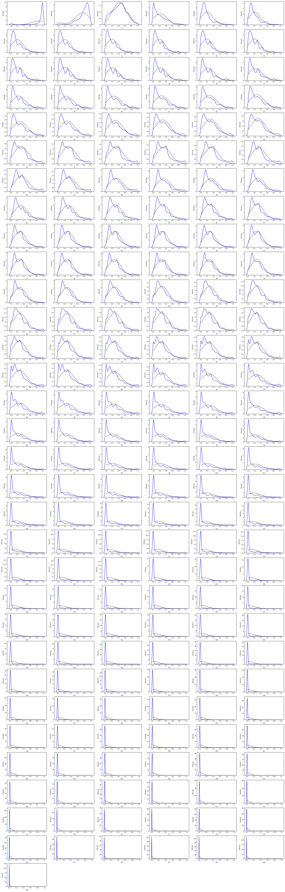
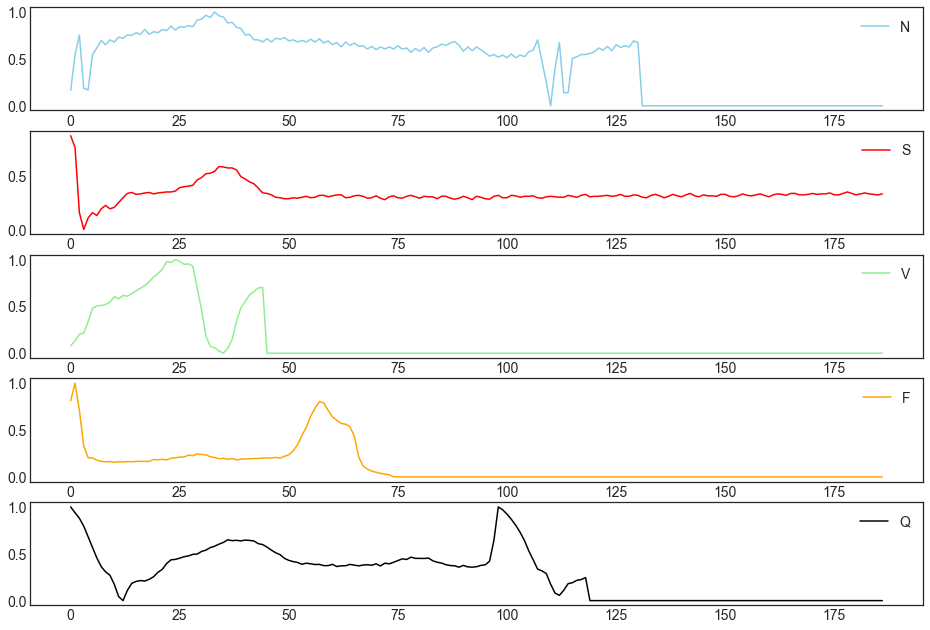
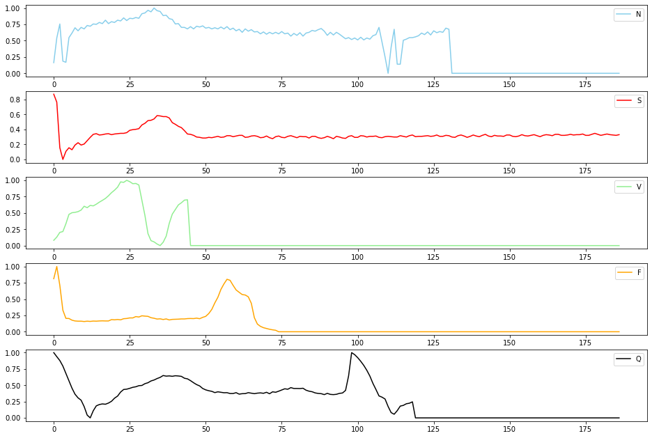
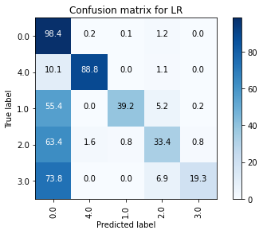
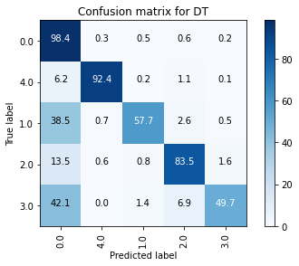
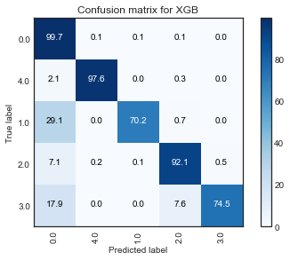
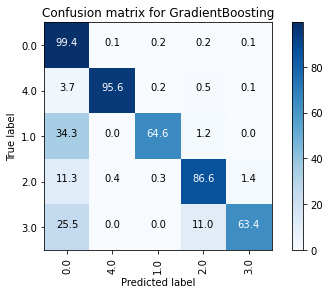
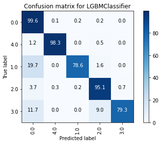
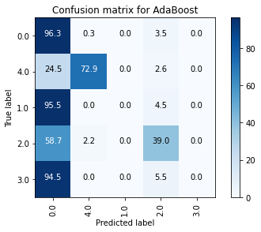
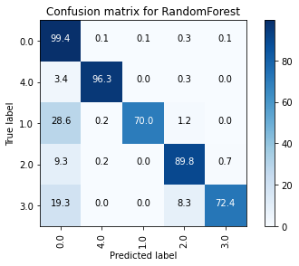

# Contents

__[1. Dataset](#DATASET)__  

__[2. Exploratory data analysis  ](#EXPLORATORY-DATA-ANALYSIS)__  

__[3. Model Selection](#MODEL-SELECTION)__  
    [3.1. Individual machine learning models](#Individual-machine-learning-models)  
    [3.2. Ensembles and boosting](#Ensembles-and-boosting)  
    [3.2.1. XGBoost](#XGBoost)  
    [3.2.2. Gradient boosting](#Gradient-boosting)  
    [3.2.3. LightGBM](#LightGBM)  
    [3.2.4. AdaBoost](#AdaBoost)  
    [3.2.5. Random forests](#Random-forests)  
    
__[4. Results](#Summary-of-the-results)__  

__[5. TO DO](#TODO)__  


```python
import numpy as np 
import pandas as pd 

import random
import itertools
from importlib import reload
from datetime import datetime

import matplotlib.pyplot as plt

from sklearn.pipeline import Pipeline
from sklearn.model_selection import train_test_split, GridSearchCV, RandomizedSearchCV

from sklearn.svm import SVC
from sklearn.ensemble import RandomForestClassifier

from sklearn import metrics
from sklearn.metrics import jaccard_score
from sklearn.metrics import f1_score
from sklearn.metrics import log_loss

# my packages
import tools as t
```

# DATASET  

The dataset is the MIT-BIH Arrhythmia Dataset:  
https://www.kaggle.com/gregoiredc/arrhythmia-on-ecg-classification-using-cnn  
https://archive.physionet.org/physiobank/database/html/mitdbdir/intro.htm

- Number of Samples: 109446
- Number of Categories: 5
- Sampling Frequency: 125Hz
- Data Source: Physionet's MIT-BIH Arrhythmia Dataset
- Classes: ['N': 0, 'S': 1, 'V': 2, 'F': 3, 'Q': 4]  
(N - Normal beat, S - Supraventricular premature beat, V - Premature ventricular contraction, F - Fusion of ventricular and normal beat, Q - Unclassifiable beat)

Each row is one beat taken from the original source (represents 10 seconds of data)

__Task:__ multiclass classification


```python
import os
for dirname, _, filenames in os.walk('/data'):
    for filename in filenames:
        print(os.path.join(dirname, filename))

        
# mitbih data
df_train = pd.read_csv('data/mitbih_train.csv', header=None)
df_test = pd.read_csv('data/mitbih_test.csv', header=None)

# combined df
train = df_train.rename(columns={187:'y'})
test = df_test.rename(columns={187:'y'})

# training data
X_train = train[train.columns[:-1]]
y_train = train[train.columns[-1]]

# testing data
X_test = test[test.columns[:-1]]
y_test = test[test.columns[-1]]
```

__[top](#Contents)__  

# EXPLORATORY DATA ANALYSIS

- The observations are skewed.
- Normal heartbeat is the most popular class. Deviations from this class are scarce, especially for class 1 (S - Supraventricular premature beat) and 3 (F - Fusion of ventricular and normal beat) and require more attention.


```python
from tools.preprocessing import eda
```


```python
cls_df = eda.Dataset(X_train)
# cls_df.get_overview()
```


```python
reload(eda)
cls_df = eda.Dataset(X_train)
cls_df.get_summary(y=y_train,
    nan=True,
    formats=True,
    categorical=True,
    min_less_0=True,
    class_counts=True,
    check_normdist=True,
    plot_boxplots=False)
```

    NaNs:  []
    Unique formats:  [dtype('float64')]
    Possible categorical variables (<10 unique values):  []
    Min value < 0:  []
    Observations per class:
    0    72471
    1     2223
    2     5788
    3      641
    4     6431
    Name: y, dtype: int64
    Plotting distributions of variables against normal distribution
    


    

    


### Observations per class


```python
labels = ['0 (N - Normal beat)',
          '1 (S - Supraventricular premature beat)',
          '2 (V - Premature ventricular contraction)',
          '3 (F - Fusion of ventricular and normal beat)',
          '4 (Q - Unclassifiable beat)']
 
plt.figure(figsize=(10, 7))
plt.pie(y_train.astype(int).value_counts().sort_index(), labels=labels, autopct='%1.1f%%', pctdistance=1.1, labeldistance=1.3)
plt.title('Observations per class')
plt.legend( bbox_to_anchor=(2, 1), loc='upper right')
plt.show()
```


    

    


### Examples from different classes


```python
# sample one observation
r_sample = df_train.groupby(187, group_keys=False).apply(lambda train_df: train_df.sample(1, random_state=42))

# plot 
fig, axes = plt.subplots(5, 1, figsize=(16, 11))
leg = iter(['N - Normal beat',
 'S - Supraventricular premature beat',
 'V - Premature ventricular contraction',
 'F - Fusion of ventricular and normal beat',
 'Q - Unclassifiable beat'])
colors = iter(['skyblue', 'red', 'lightgreen', 'orange', 'black'])
for i, ax in enumerate(axes.flatten()):
    ax.plot(r_sample.iloc[i, :187], color=next(colors))
#     print(next(leg))
    ax.legend(next(leg))
plt.show()

```


    

    


__[top](#Contents)__  

# MODEL SELECTION  

__The problem__:  
Although the accuracy is pretty high (90%), recall is very low for some classes (1 (S - Supraventricular premature beat) and 3 (F - Fusion of ventricular and normal beat)). Since the dataset is unbalanced (normal beat represents the majority of the datapoints), accuracy is not a good measure for assessing model performance, because we should focus on positive cases for these classes if we wish to identify the disease. 

So, we need to improve __recall__, the ability of a model to find all relevant cases within a dataset, while keeping the precision at an appropriate level.


```python
#train validation split
X_train, X_val, y_train, y_val = train_test_split(train.iloc[:,:-1], train.iloc[:,-1], 
                                                    test_size=0.2, random_state=42)

import multiprocessing
n_jobs=multiprocessing.cpu_count()  # 56

#my package
import tools as t
reload(t)
from tools.models import classification as c

# Create the pipeline
from sklearn.preprocessing import StandardScaler
steps = [
#     ('scaler', StandardScaler()),
#     ('scaler', RobustScaler()),
#     ('pca', PCA(n_components=)),
]

cls_models = c.SimpleML(X_train, y_train, X_val, y_val)

```

## Individual machine learning models

- Original dataset was used (no feature selection, no sampling).
- Models which were compared: Naive Bayes, Logistic regression, SVM, kNN, Decision trees.
- Best performing models based on recall: SVM, kNN, DT.


```python
best_model, allmodels = cls_models.classification_models(multiclass=True,
                                                             steps=steps,
                                                                     metric='recall',
                                                                     average='weighted',
                                                                     randomized_search=False, 
                                                                     nfolds=5,
                                                                     verbose=0,
                                                                     n_jobs=n_jobs)
```

    2021-06-06 18:16:42
    
    ========== NB RESULT ==========
    Mean cross-validated score of the best_estimator: 0.1719
    Tuned parameters: {}
    F1-score: 0.1849
    Precision: 0.7952
    Recall: 0.1781
    Accuracy on train data: 0.1795
    Accuracy on test data: 0.1781
    


    

    


    [('NB', GaussianNB())]
    []
    
    ========== LR RESULT ==========
    Mean cross-validated score of the best_estimator: 0.9126
    Tuned parameters: {'LR__class_weight': None, 'LR__multi_class': 'multinomial'}
    F1-score: 0.9027
    Precision: 0.9044
    Recall: 0.9152
    Accuracy on train data: 0.9145
    Accuracy on test data: 0.9152
    


    

    


    [('LR', LogisticRegression(max_iter=10000))]
    []
    
    ========== SVM RESULT ==========
    Mean cross-validated score of the best_estimator: 0.9803
    Tuned parameters: {'SVM__C': 50, 'SVM__gamma': 0.1, 'SVM__kernel': 'rbf'}
    F1-score: 0.9795
    Precision: 0.9797
    Recall: 0.9802
    Accuracy on train data: 0.9917
    Accuracy on test data: 0.9802
    


    

    


    [('SVM', SVC())]
    []
    
    ========== KNN RESULT ==========
    Mean cross-validated score of the best_estimator: 0.9773
    Tuned parameters: {'KNN__n_neighbors': 4, 'KNN__p': 1, 'KNN__weights': 'distance'}
    F1-score: 0.9762
    Precision: 0.9762
    Recall: 0.9769
    Accuracy on train data: 1.0
    Accuracy on test data: 0.9769
    


    

    


    [('KNN', KNeighborsClassifier())]
    []
    
    ========== DT RESULT ==========
    Mean cross-validated score of the best_estimator: 0.9542
    Tuned parameters: {'DT__class_weight': None, 'DT__criterion': 'entropy', 'DT__max_depth': 14, 'DT__max_features': 'sqrt', 'DT__random_state': 42}
    F1-score: 0.9545
    Precision: 0.9538
    Recall: 0.9559
    Accuracy on train data: 0.9859
    Accuracy on test data: 0.9559
    


    

    


    [('DT', DecisionTreeClassifier())]
    []
    __________________________________________________
    Best model: SVM
    Tuned parameters: {'SVM__C': 50, 'SVM__gamma': 0.1, 'SVM__kernel': 'rbf'}
    BEST recall: 0.9802
    ==================================================
         accuracy  precision  recall      f1
    SVM    0.9802     0.9797  0.9802  0.9795
    KNN    0.9769     0.9762  0.9769  0.9762
    DT     0.9559     0.9538  0.9559  0.9545
    LR     0.9152     0.9044  0.9152  0.9027
    NB     0.1781     0.7952  0.1781  0.1849
    2021-06-06 18:53:13
    

#### Conclusions:

1. ___Recall equals accuracy:___
    - indicates that sensitivity (TPR) is equal to specificity (TNR), and thus they are also equal to accuracy. This means that the model's ability to correctly classify positive samples is same as its ability to correctly classify negative samples.


2. ___Model performance:___
    - SVM shows the best results among all tested models. However, confusion matrix shows that even it has problems with classifying labels 1 (S - Supraventricular premature beat) and 3 (F - Fusion of ventricular and normal beat).


__[top](#Contents)__  

## Ensembles and boosting

### XGBoost


```python
%%time

import xgboost as xgb

name = 'XGB'
model = xgb.XGBClassifier(    
    seed=42,
    verbosity=0,
    use_label_encoder=False,
    objective='multi:softmax',
    num_class=5,
#     eval_metric='mlogloss',
    eval_metric='merror',
)

steps=[]

parameters = {    
    'XGB__eta': [0.05, 0.3, 0.5],  # 0.3
    'XGB__gamma': [0, 1, 5],  # 0
    'XGB__max_depth': [3, 6, 10],  # 6
    'XGB__min_child_weight': [0.5, 1],  # 1
    'XGB__subsample': [0.7, 1],  # 1
    'XGB__sampling_method': ['uniform', 'gradient_based'],  # uniform
#     'XGB__colsample_bytree': [0.7],  # 1
    'XGB__lambda': [1],  # 1
    'XGB__alpha': [0],  # 0
    'XGB__tree_method': ['auto'],  # auto
    'XGB__scale_pos_weight': [0.3, 0.7, 1],  # 1
    'XGB__predictor': ['cpu_predictor'],  # auto
    'XGB__num_parallel_tree': [1],  # 1

#     n_jobs = n_jobs
}
# https://xgboost.readthedocs.io/en/latest/parameter.html#general-parameters

model_xgb = cls_models.checkmodel(
                                    name,
                                    model,
                                    steps=steps,
                                    parameters=parameters,
                                    average='weighted',
                                    multiclass=True,
                                    metric='recall',
                                    randomized_search=False,
                                    nfolds=5,
                                    n_jobs=56,
                                    verbose=1
                                    )

# Wall time: 4min 16s
# Wall time: 3min 5s
# 
```

    Fitting 5 folds for each of 648 candidates, totalling 3240 fits
    

    [Parallel(n_jobs=56)]: Using backend LokyBackend with 56 concurrent workers.
    [Parallel(n_jobs=56)]: Done  88 tasks      | elapsed: 18.2min
    [Parallel(n_jobs=56)]: Done 338 tasks      | elapsed: 102.6min
    [Parallel(n_jobs=56)]: Done 688 tasks      | elapsed: 204.1min
    [Parallel(n_jobs=56)]: Done 1138 tasks      | elapsed: 330.1min
    [Parallel(n_jobs=56)]: Done 1688 tasks      | elapsed: 473.6min
    [Parallel(n_jobs=56)]: Done 2338 tasks      | elapsed: 659.1min
    [Parallel(n_jobs=56)]: Done 3088 tasks      | elapsed: 860.8min
    [Parallel(n_jobs=56)]: Done 3240 out of 3240 | elapsed: 915.8min finished
    

    Mean cross-validated score of the best_estimator: 0.9805
    Tuned parameters: {'XGB__alpha': 0, 'XGB__eta': 0.5, 'XGB__gamma': 0, 'XGB__lambda': 1, 'XGB__max_depth': 10, 'XGB__min_child_weight': 0.5, 'XGB__num_parallel_tree': 1, 'XGB__predictor': 'cpu_predictor', 'XGB__sampling_method': 'uniform', 'XGB__scale_pos_weight': 0.3, 'XGB__subsample': 0.7, 'XGB__tree_method': 'auto'}
    F1-score: 0.9806
    Precision: 0.9811
    Recall: 0.9814
    Accuracy on train data: 1.0
    Accuracy on test data: 0.9814
    


    

    


    Wall time: 15h 16min 37s
    

__[top](#Contents)__  

### Gradient boosting


```python
%%time
from sklearn.ensemble import GradientBoostingClassifier

name='GradientBoosting'
model = GradientBoostingClassifier(random_state=42)

steps=[]

parameters = {
    'GradientBoosting__loss': ['deviance'],  # 'deviance'
    'GradientBoosting__learning_rate': [0.1, 0.5, 0.01],  # 0.1
    'GradientBoosting__n_estimators': [100, 500, 50],  # 100
    'GradientBoosting__subsample': [1, 0.5, 0.7],  # 1
    'GradientBoosting__criterion': ['friedman_mse'],  # 'friedman_mse'
    'GradientBoosting__min_samples_split': [2, 5],  # 2
    'GradientBoosting__min_samples_leaf': [1],  # 1
    'GradientBoosting__min_weight_fraction_leaf': [0],  # 0
    'GradientBoosting__max_depth': [3, 5],  # 3
    'GradientBoosting__min_impurity_decrease': [0],  # 0
#     'GradientBoosting__max_features': [None, 'auto', 'sqrt', 'log2'],  # None
    'GradientBoosting__max_leaf_nodes': [None],  # None
    'GradientBoosting__validation_fraction': [0.1],  # 0.1
    'GradientBoosting__n_iter_no_change': [5],  # 0
}

model_gb = cls_models.checkmodel(
                                    name,
                                    model,
                                    steps=steps,
                                    parameters=parameters,
                                    average='weighted',
                                    multiclass=True,
                                    metric='recall',
                                    randomized_search=False,
                                    nfolds=5,
                                    n_jobs=56,
                                    verbose=1
                                    )
# plt.savefig("learning.png", dpi=300, bbox_inches='tight')

```

    Fitting 5 folds for each of 108 candidates, totalling 540 fits
    

    [Parallel(n_jobs=56)]: Using backend LokyBackend with 56 concurrent workers.
    [Parallel(n_jobs=56)]: Done  88 tasks      | elapsed: 37.4min
    [Parallel(n_jobs=56)]: Done 338 tasks      | elapsed: 75.8min
    [Parallel(n_jobs=56)]: Done 540 out of 540 | elapsed: 363.2min finished
    

    Mean cross-validated score of the best_estimator: 0.9682
    Tuned parameters: {'GradientBoosting__criterion': 'friedman_mse', 'GradientBoosting__learning_rate': 0.1, 'GradientBoosting__loss': 'deviance', 'GradientBoosting__max_depth': 5, 'GradientBoosting__max_leaf_nodes': None, 'GradientBoosting__min_impurity_decrease': 0, 'GradientBoosting__min_samples_leaf': 1, 'GradientBoosting__min_samples_split': 2, 'GradientBoosting__min_weight_fraction_leaf': 0, 'GradientBoosting__n_estimators': 500, 'GradientBoosting__n_iter_no_change': 5, 'GradientBoosting__subsample': 1, 'GradientBoosting__validation_fraction': 0.1}
    F1-score: 0.9707
    Precision: 0.9709
    Recall: 0.9718
    Accuracy on train data: 0.9904
    Accuracy on test data: 0.9718
    


    

    


    Wall time: 7h 7min 57s
    

__[top](#Contents)__  

### LightGBM


```python
%%time
import lightgbm as lgb

name='LGBMClassifier'
model = lgb.LGBMClassifier(seed=42, random_state=42,
                         objective='multiclass', 
                         n_jobs=51
                         )

steps=[]

parameters = {
    'LGBMClassifier__boosting_type': ['gbdt'],  # 'gbdt'
    'LGBMClassifier__num_leaves': [31],  # 31
    'LGBMClassifier__max_depth': [-1, 10, 50],  # -1
    'LGBMClassifier__learning_rate': [0.1, 0.05, 0.5],  # 0.1
    'LGBMClassifier__n_estimators': [100, 500],  # 100
#     'LGBMClassifier__subsample_for_bin': [200000],  # 200000
    'LGBMClassifier__class_weight': [None, 'balanced', {0:0.1, 1:0.3, 2:0.1, 3:0.4, 4:0.1}],  # None
#     'LGBMClassifier__min_split_gain': [0],  # 0
#     'LGBMClassifier__min_child_weight': [1e-3],  # 1e-3
    'LGBMClassifier__min_child_samples': [20],  # 20
    'LGBMClassifier__subsample': [1, 0.7],  # 1
#     'LGBMClassifier__colsample_bytree': [1],  # 1
    'LGBMClassifier__reg_alpha': [0, 0.03, 0.07],  # 0
    'LGBMClassifier__reg_lambda': [0, 0.03, 0.07],  # 0
}

model_lgbm = cls_models.checkmodel(
                                    name,
                                    model,
                                    steps=steps,
                                    parameters=parameters,
                                    average='weighted',
                                    multiclass=True,
                                    metric='recall',
                                    randomized_search=False,
                                    nfolds=5,
                                    n_jobs=56,
                                    verbose=1
                                    )
```

    Fitting 5 folds for each of 972 candidates, totalling 4860 fits
    

    [Parallel(n_jobs=56)]: Using backend LokyBackend with 56 concurrent workers.
    [Parallel(n_jobs=56)]: Done  88 tasks      | elapsed:  5.7min
    [Parallel(n_jobs=56)]: Done 338 tasks      | elapsed: 36.3min
    [Parallel(n_jobs=56)]: Done 688 tasks      | elapsed: 72.6min
    [Parallel(n_jobs=56)]: Done 1138 tasks      | elapsed: 119.9min
    [Parallel(n_jobs=56)]: Done 1688 tasks      | elapsed: 151.9min
    [Parallel(n_jobs=56)]: Done 2338 tasks      | elapsed: 226.0min
    [Parallel(n_jobs=56)]: Done 3088 tasks      | elapsed: 292.5min
    [Parallel(n_jobs=56)]: Done 3938 tasks      | elapsed: 366.3min
    [Parallel(n_jobs=56)]: Done 4860 out of 4860 | elapsed: 435.9min finished
    

    [LightGBM] [Warning] seed is set=42, random_state=42 will be ignored. Current value: seed=42
    Mean cross-validated score of the best_estimator: 0.984
               Parameter Tuned value
    0      boosting_type        gbdt
    1       class_weight    balanced
    2      learning_rate         0.1
    3          max_depth          -1
    4  min_child_samples          20
    5       n_estimators         500
    6         num_leaves          31
    7          reg_alpha        0.03
    8         reg_lambda           0
    9          subsample           1
    F1-score: 0.9849
    Precision: 0.9849
    Recall: 0.9852
    Accuracy on train data: 1.0
    Accuracy on test data: 0.9852
    


    

    


    Wall time: 7h 16min 32s
    

__[top](#Contents)__  

### AdaBoost


```python
%%time
from sklearn.ensemble import AdaBoostClassifier
from sklearn.ensemble import AdaBoostClassifier
from sklearn.linear_model import LogisticRegression
from sklearn.naive_bayes import GaussianNB
from sklearn.svm import SVC
from sklearn.neighbors import KNeighborsClassifier
from sklearn.discriminant_analysis import LinearDiscriminantAnalysis, QuadraticDiscriminantAnalysis
from sklearn.tree import DecisionTreeClassifier

name='AdaBoost'
model = AdaBoostClassifier(random_state=42)

steps=[]

parameters = {
    'AdaBoost__base_estimator': [None],  # None
    'AdaBoost__n_estimators': [50, 200, 500],  # 50
    'AdaBoost__learning_rate': [1, 0.05, 0.5],  # 1
#     'AdaBoost__algorithm': ['SAMME.R'],  # SAMME.R
}

model_ada = cls_models.checkmodel(
                                    name,
                                    model,
                                    steps=steps,
                                    parameters=parameters,
                                    average='weighted',
                                    multiclass=True,
                                    metric='recall',
                                    randomized_search=False,
                                    nfolds=5,
                                    n_jobs=45,
                                    verbose=1
                                    )
```

    Fitting 5 folds for each of 9 candidates, totalling 45 fits
    

    [Parallel(n_jobs=45)]: Using backend LokyBackend with 45 concurrent workers.
    [Parallel(n_jobs=45)]: Done   2 out of  45 | elapsed:  1.2min remaining: 24.8min
    [Parallel(n_jobs=45)]: Done  45 out of  45 | elapsed:  8.7min finished
    

    Mean cross-validated score of the best_estimator: 0.8722
            Parameter Tuned value
    0  base_estimator        None
    1   learning_rate         0.5
    2    n_estimators          50
    

    C:\ProgramData\Anaconda3\lib\site-packages\sklearn\metrics\_classification.py:1221: UndefinedMetricWarning: Precision is ill-defined and being set to 0.0 in labels with no predicted samples. Use `zero_division` parameter to control this behavior.
      _warn_prf(average, modifier, msg_start, len(result))
    

    F1-score: 0.8605
    Precision: 0.8462
    Recall: 0.8782
    Accuracy on train data: 0.8757
    Accuracy on test data: 0.8782
    


    

    


    Wall time: 9min 37s
    

__[top](#Contents)__  

### Random forests


```python
%%time
from sklearn.ensemble import RandomForestClassifier

name='RandomForest'
model = RandomForestClassifier(random_state=42,
                              n_jobs=None,  # None
                              )

steps=[]

parameters = {
    'RandomForest__n_estimators': [100, 500],  # 100
    'RandomForest__criterion': ['gini'],  # gini
    'RandomForest__max_depth': [None, 5, 10],  # None
    'RandomForest__min_samples_split': [2, 5],  # 2
    'RandomForest__min_samples_leaf': [1, 5],  # 1
    'RandomForest__min_weight_fraction_leaf': [0],  # 0
#     'RandomForest__max_features': ['auto'],  # auto
    'RandomForest__max_leaf_nodes': [None],  # None
    'RandomForest__min_impurity_decrease': [0],  # 0
    'RandomForest__bootstrap': [True],  # True
    'RandomForest__oob_score': [True],  # False - only if bootstrap=True
    'RandomForest__max_samples': [None],  # None - if bootstrap=True
    'RandomForest__class_weight': [None, 'balanced', {0:0.1, 1:0.3, 2:0.1, 3:0.4, 4:0.1}],  # None
}

model_rf = cls_models.checkmodel(
                                    name,
                                    model,
                                    steps=steps,
                                    parameters=parameters,
                                    average='weighted',
                                    multiclass=True,
                                    metric='recall',
                                    randomized_search=False,
                                    nfolds=5,
                                    n_jobs=56,
                                    verbose=1
                                    )
```

    Fitting 5 folds for each of 72 candidates, totalling 360 fits
    

    [Parallel(n_jobs=56)]: Using backend LokyBackend with 56 concurrent workers.
    [Parallel(n_jobs=56)]: Done  88 tasks      | elapsed:  6.6min
    [Parallel(n_jobs=56)]: Done 360 out of 360 | elapsed: 24.0min finished
    

    Mean cross-validated score of the best_estimator: 0.975
    Tuned parameters: {'RandomForest__bootstrap': True, 'RandomForest__class_weight': 'balanced', 'RandomForest__criterion': 'gini', 'RandomForest__max_depth': None, 'RandomForest__max_leaf_nodes': None, 'RandomForest__max_samples': None, 'RandomForest__min_impurity_decrease': 0, 'RandomForest__min_samples_leaf': 5, 'RandomForest__min_samples_split': 2, 'RandomForest__min_weight_fraction_leaf': 0, 'RandomForest__n_estimators': 500, 'RandomForest__oob_score': True}
    F1-score: 0.9759
    Precision: 0.9762
    Recall: 0.9767
    Accuracy on train data: 0.9967
    Accuracy on test data: 0.9767
    


    

    


    Wall time: 29min 22s
    

__[top](#Contents)__ 

# Summary of the results


| Model                 | F1 score | Precision | Recall  | Accuracy |
|-----------------------|----------|-----------|---------|----------|
| Light GBM             | 0.9849   | 0.9849    | 0.9852  | 0.9852   |
| XGBoost               | 0.9806   | 0.9811    | 0.9814  | 0.9814   |
| SVM                   | 0.9795   | 0.9797    | 0.9802  | 0.9802   |
| kNN                   | 0.9762   | 0.9762    | 0.9769  | 0.9769   |
| Random Forest         | 0.9759   | 0.9762    | 0.9767  | 0.9767   |
| Gradient Boosting     | 0.9707   | 0.9709    | 0.9718  | 0.9718   |
| Decision Trees        | 0.9545   | 0.9538    | 0.9559  | 0.9559   |
| Logistic Regression   | 0.9027   | 0.9044    | 0.9152  | 0.9152   |
| Naive Bayes           | 0.1849   | 0.7952    | 0.1781  | 0.1781   |


# TODO

- Fine tuning
- Compare models constructed on balanced / unbalanced dataset using different down-sampling/upsampling techniques.

__[top](#Contents)__  
