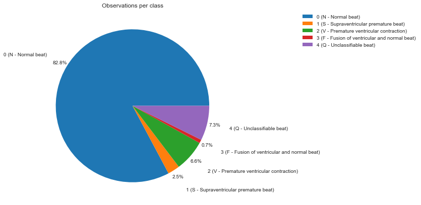
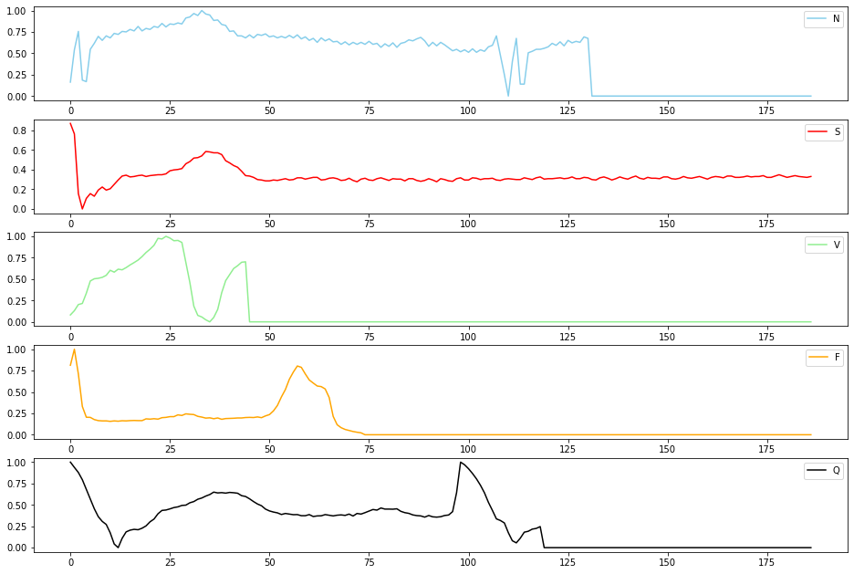
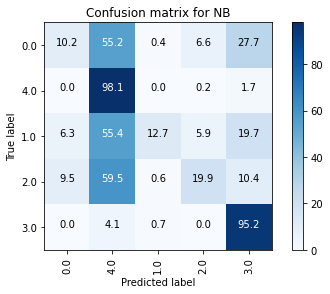
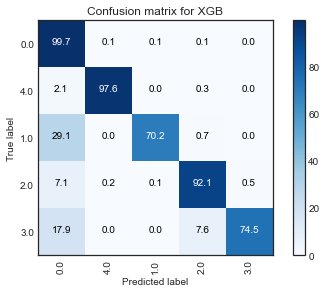
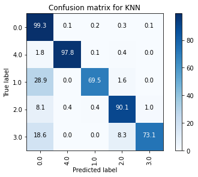

```python
import numpy as np 
import pandas as pd 

import random
import itertools
from importlib import reload
from datetime import datetime

import matplotlib.pyplot as plt

from sklearn.pipeline import Pipeline
from sklearn.model_selection import train_test_split, GridSearchCV, RandomizedSearchCV

from sklearn.svm import SVC
from sklearn.ensemble import RandomForestClassifier

from sklearn import metrics
from sklearn.metrics import jaccard_score
from sklearn.metrics import f1_score
from sklearn.metrics import log_loss

# my packages
import ecgn
import tools as t
# from tools import classification as c

```

# DATASET  

The dataset is the MIT-BIH Arrhythmia Dataset:  
https://www.kaggle.com/gregoiredc/arrhythmia-on-ecg-classification-using-cnn  
https://archive.physionet.org/physiobank/database/html/mitdbdir/intro.htm

- Number of Samples: 109446
- Number of Categories: 5
- Sampling Frequency: 125Hz
- Data Source: Physionet's MIT-BIH Arrhythmia Dataset
- Classes: ['N': 0, 'S': 1, 'V': 2, 'F': 3, 'Q': 4]  
(N - Normal beat, S - Supraventricular premature beat, V - Premature ventricular contraction, F - Fusion of ventricular and normal beat, Q - Unclassifiable beat)

__Interpretation of the dataset__: 
- each row is one beat taken from the original source (represents 10 seconds of data)
- 

__Task__
- multiclass classification


```python
import os
for dirname, _, filenames in os.walk('/data'):
    for filename in filenames:
        print(os.path.join(dirname, filename))

        
# mitbih data
df_train = pd.read_csv('data/mitbih_train.csv', header=None)
df_test = pd.read_csv('data/mitbih_test.csv', header=None)

# combined df
train = df_train.rename(columns={187:'y'})
test = df_test.rename(columns={187:'y'})

# training data
X_train = train[train.columns[:-1]]
y_train = train[train.columns[-1]]

# testing data
X_test = test[test.columns[:-1]]
y_test = test[test.columns[-1]]
```

# EDA

```python
reload(eda)
cls_df = eda.Dataset(X_train)
cls_df.get_summary(y=y_train,
    nan=True,
    formats=True,
    categorical=True,
    min_less_0=True,
    class_counts=True,
    check_normdist=True,
    plot_boxplots=False)
```

    NaNs:  []
    Unique formats:  [dtype('float64')]
    Possible categorical variables (<10 unique values):  []
    Min value < 0:  []
    Observations per class:
     0    72471
    1     2223
    2     5788
    3      641
    4     6431
    Name: y, dtype: int64
    Plotting distributions of variables against normal distribution
    

    

    


### Observations per class


```python
labels = ['0 (N - Normal beat)',
          '1 (S - Supraventricular premature beat)',
          '2 (V - Premature ventricular contraction)',
          '3 (F - Fusion of ventricular and normal beat)',
          '4 (Q - Unclassifiable beat)']
 
plt.figure(figsize=(10, 7))
plt.pie(y_train.astype(int).value_counts().sort_index(), labels=labels, autopct='%1.1f%%', pctdistance=1.1, labeldistance=1.3)
plt.title('Observations per class')
plt.legend( bbox_to_anchor=(2, 1), loc='upper right')
plt.show()
```


    

    


### Examples from different classes


```python
# sample one observation
r_sample = df_train.groupby(187, group_keys=False).apply(lambda train_df: train_df.sample(1, random_state=42))

# plot 
fig, axes = plt.subplots(5, 1, figsize=(16, 11))
leg = iter(['N - Normal beat',
 'S - Supraventricular premature beat',
 'V - Premature ventricular contraction',
 'F - Fusion of ventricular and normal beat',
 'Q - Unclassifiable beat'])
colors = iter(['skyblue', 'red', 'lightgreen', 'orange', 'black'])
for i, ax in enumerate(axes.flatten()):
    ax.plot(r_sample.iloc[i, :187], color=next(colors))
#     print(next(leg))
    ax.legend(next(leg))
plt.show()

```


    

 

# MODEL SELECTION  

__The problem__:  
Although the accuracy is pretty high (90%), recall is very low for some classes (1 (S - Supraventricular premature beat) and 3 (F - Fusion of ventricular and normal beat)). Since the dataset is unbalanced (normal beat represents the majority of the datapoints), accuracy is not a good measure for assessing model performance, because we should focus on positive cases for these classes if we wish to identify the disease. 

So, we need to improve __recall__, the ability of a model to find all relevant cases within a dataset, while keeping the precision at an appropriate level.


## ML

- compare models constructed on balanced / unbalanced dataset
- models: SVM, random forests, boosting
- fine tuning


```python
#train validation split
X_train, X_val, y_train, y_val = train_test_split(train.iloc[:,:-1], train.iloc[:,-1], 
                                                    test_size=0.2, random_state=42)

```


```python
import multiprocessing
n_jobs=multiprocessing.cpu_count()  # 56

#my package
import tools as t
reload(t)
from tools.models import classification as c

# Create the pipeline
from sklearn.preprocessing import StandardScaler
steps = [
#     ('scaler', StandardScaler()),
#     ('scaler', RobustScaler()),
#     ('pca', PCA(n_components=)),
]

ci_individualm = c.SimpleML(X_train, y_train, X_val, y_val)


best_model, allmodels = ci_individualm.classification_models(multiclass=True,
                                                             steps=steps,
                                                                     metric='recall',
                                                                     average='weighted',
                                                                     randomized_search=False, 
                                                                     nfolds=5,
                                                                     verbose=0,
                                                                     n_jobs=n_jobs)
```

    2021-06-06 18:16:42
    
    ========== NB RESULT ==========
    Mean cross-validated score of the best_estimator: 0.1719
    Tuned parameters: {}
    F1-score: 0.1849
    Precision: 0.7952
    Recall: 0.1781
    Accuracy on train data: 0.1795
    Accuracy on test data: 0.1781
    


    

    


    [('NB', GaussianNB())]
    []
    
    ========== LR RESULT ==========
    Mean cross-validated score of the best_estimator: 0.9126
    Tuned parameters: {'LR__class_weight': None, 'LR__multi_class': 'multinomial'}
    F1-score: 0.9027
    Precision: 0.9044
    Recall: 0.9152
    Accuracy on train data: 0.9145
    Accuracy on test data: 0.9152
    


    

    


    [('LR', LogisticRegression(max_iter=10000))]
    []
    
    ========== SVM RESULT ==========
    Mean cross-validated score of the best_estimator: 0.9803
    Tuned parameters: {'SVM__C': 50, 'SVM__gamma': 0.1, 'SVM__kernel': 'rbf'}
    F1-score: 0.9795
    Precision: 0.9797
    Recall: 0.9802
    Accuracy on train data: 0.9917
    Accuracy on test data: 0.9802
    


    

    


    [('SVM', SVC())]
    []
    
    ========== KNN RESULT ==========
    Mean cross-validated score of the best_estimator: 0.9773
    Tuned parameters: {'KNN__n_neighbors': 4, 'KNN__p': 1, 'KNN__weights': 'distance'}
    F1-score: 0.9762
    Precision: 0.9762
    Recall: 0.9769
    Accuracy on train data: 1.0
    Accuracy on test data: 0.9769
    


    

    


    [('KNN', KNeighborsClassifier())]
    []
    
    ========== DT RESULT ==========
    Mean cross-validated score of the best_estimator: 0.9542
    Tuned parameters: {'DT__class_weight': None, 'DT__criterion': 'entropy', 'DT__max_depth': 14, 'DT__max_features': 'sqrt', 'DT__random_state': 42}
    F1-score: 0.9545
    Precision: 0.9538
    Recall: 0.9559
    Accuracy on train data: 0.9859
    Accuracy on test data: 0.9559
    


    

    


    [('DT', DecisionTreeClassifier())]
    []
    __________________________________________________
    Best model: SVM
    Tuned parameters: {'SVM__C': 50, 'SVM__gamma': 0.1, 'SVM__kernel': 'rbf'}
    BEST recall: 0.9802
    ==================================================
         accuracy  precision  recall      f1
    SVM    0.9802     0.9797  0.9802  0.9795
    KNN    0.9769     0.9762  0.9769  0.9762
    DT     0.9559     0.9538  0.9559  0.9545
    LR     0.9152     0.9044  0.9152  0.9027
    NB     0.1781     0.7952  0.1781  0.1849
    2021-06-06 18:53:13
    

#### Conclusions:

1. ___recall = accuracy:___
    - indicates that sensitivity (a.k.a. recall, or TPR) is equal to specificity (a.k.a. selectivity, or TNR), and thus they are also equal to accuracy. This means that the model's ability to correctly classify positive samples is same as its ability to correctly classify negative samples.
