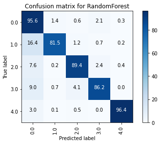
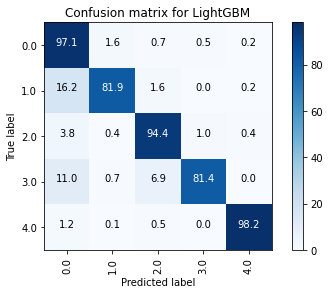
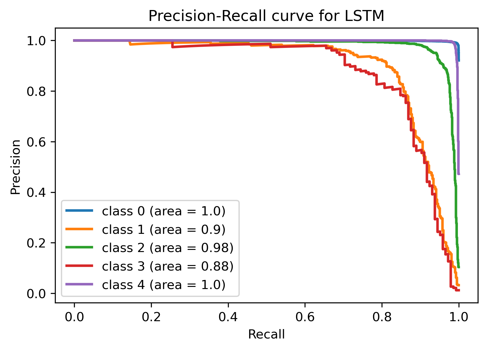

# Contents


__[1. Dataset](#DATASET)__  

__[2. Exploratory data analysis  ](#EXPLORATORY-DATA-ANALYSIS)__  

__[3. Model Selection](#MODEL-SELECTION)__  
    [3.1. Individual machine learning models](#Individual-machine-learning-models)  
    [3.1.1. K-Nearest Neighbors](#K-Nearest-Neighbors)  
    [3.1.2. SVM](#SVM) 
    [3.2. Ensembles and boosting](#Ensembles-and-boosting)  
    [3.2.1. XGBoost](#XGBoost)  
    [3.2.2. Gradient boosting](#Gradient-boosting)  
    [3.2.3. LightGBM](#LightGBM)  
    [3.2.4. AdaBoost](#AdaBoost)  
    [3.2.5. Random Forest](#Random-Forest)  
    [3.3. Deep Learning](#Deep-Learning)  
    [3.3.1. CNN](#CNN)  
    [3.3.2. LSTM](#LSTM)  
    [3.3.3. Bidirectional LSTM](#Bidirectional-LSTM)  
    
__[4. Resampling](#Resamling)__  
    [4.1. SMOTE Tomek-Links Method](#SMOTE-Tomek-Links-Method)  
    [4.1.1 SMOTE Tomek-Links for SVM](#SMOTE-Tomek-Links-for-SVM)  
    [4.1.2 SMOTE Tomek-Links for LightGBM](#SMOTE-Tomek-Links-for-LightGBM)  
    [4.1.3 SMOTE Tomek-Links for Random Forest](#SMOTE-Tomek-Links-for-Random-Forest)  
    [4.1.4 SMOTE Tomek-Links for CNN](#SMOTE-Tomek-Links-for-CNN)  
    [4.1.5 SMOTE Tomek-Links for LSTM](#SMOTE-Tomek-Links-for-LSTM)  
    [4.1.6 SMOTE Tomek-Links for Bidirectional LSTM](#SMOTE-Tomek-Links-for-Bidirectional-LSTM)  
    [4.2. SMOTE ENN Method](#SMOTE-ENN-Method)  
    [4.2.1 SMOTE ENN for SVM](#SMOTE-ENN-for-SVM)  
    [4.2.2 SMOTE ENN for LightGBM](#SMOTE-ENN-for-LightGBM)  
    [4.2.3 SMOTE ENN for Random Forest](#SMOTE-ENN-for-Random-Forest)  
    [4.2.4 SMOTE ENN for CNN](#SMOTE-ENN-for-CNN)  
    [4.2.5 SMOTE ENN for LSTM](#SMOTE-ENN-for-LSTM)  
    [4.2.6 SMOTE ENN for Bidirectional LSTM](#SMOTE-ENN-for-Bidirectional-LSTM)  

__[⁽ⁿᵉʷ⁾5. Summary of the results](#Summary-of-the-results)__  
    [⁽ⁿᵉʷ⁾5.1. Tables](#Tables)  
    [⁽ⁿᵉʷ⁾5.2. Metrics per class for original dataset](#Metrics-per-class-for-original-dataset)  
    [⁽ⁿᵉʷ⁾5.3. Metrics per class for resampled dataset](#Metrics-per-class-for-resampled-dataset)  


# DATASET  

The dataset is the MIT-BIH Arrhythmia Dataset:  
https://www.kaggle.com/gregoiredc/arrhythmia-on-ecg-classification-using-cnn  
https://archive.physionet.org/physiobank/database/html/mitdbdir/intro.htm

- Number of Samples: 109446
- Number of Categories: 5
- Sampling Frequency: 125Hz
- Data Source: Physionet's MIT-BIH Arrhythmia Dataset
- Classes: ['N': 0, 'S': 1, 'V': 2, 'F': 3, 'Q': 4]  
(N - Normal beat, S - Supraventricular premature beat, V - Premature ventricular contraction, F - Fusion of ventricular and normal beat, Q - Unclassifiable beat)

Each row is one beat taken from the original source (represents 10 seconds of data)

__Task:__ multiclass classification


```python
import numpy as np 
import pandas as pd 

import random
import itertools
from importlib import reload
from datetime import datetime

import matplotlib.pyplot as plt

from sklearn.pipeline import Pipeline
from sklearn.model_selection import train_test_split, GridSearchCV, RandomizedSearchCV

from sklearn.svm import SVC
from sklearn.ensemble import RandomForestClassifier

from sklearn.metrics import classification_report, confusion_matrix, roc_auc_score, roc_curve, auc
from sklearn.metrics import precision_recall_curve

from imblearn.combine import SMOTEENN, SMOTETomek
from imblearn.under_sampling import EditedNearestNeighbours, TomekLinks

# my packages
import pipelitools as t

SMALL_SIZE = 8
MEDIUM_SIZE = 10
BIGGER_SIZE = 14

plt.rc('font', size=BIGGER_SIZE)          # controls default text sizes
plt.rc('axes', titlesize=BIGGER_SIZE)     # fontsize of the axes title
plt.rc('axes', labelsize=BIGGER_SIZE)    # fontsize of the x and y labels
plt.rc('xtick', labelsize=BIGGER_SIZE)    # fontsize of the tick labels
plt.rc('ytick', labelsize=BIGGER_SIZE)    # fontsize of the tick labels
plt.rc('legend', fontsize=BIGGER_SIZE)    # legend fontsize
plt.rc('figure', titlesize=BIGGER_SIZE)  # fontsize of the figure title

import os
for dirname, _, filenames in os.walk('../data'):
    for filename in filenames:
        print(os.path.join(dirname, filename))
        
# mitbih data
df_train = pd.read_csv('./data/mitbih_train.csv', header=None)
df_test = pd.read_csv('./data/mitbih_test.csv', header=None)

# combined df
train = df_train.rename(columns={187:'y'})
test = df_test.rename(columns={187:'y'})

# training data
X_train = train[train.columns[:-1]]
y_train = train[train.columns[-1]]

# testing data
X_test = test[test.columns[:-1]]
y_test = test[test.columns[-1]]
```

__[top](#Contents)__  

# EXPLORATORY DATA ANALYSIS

- The observations are skewed.
- Normal heartbeat is the most popular class. Deviations from this class are scarce, especially for class 1 (S - Supraventricular premature beat) and 3 (F - Fusion of ventricular and normal beat) and require more attention.


```python
from pipelitools.preprocessing import outliers as o
reload(o)

cls_outliers = o.Outliers(X_train)
df_clean, df_outliers, df_marked = cls_outliers.show_outliers(X_train.columns, how='z_score', show_plot=True, threshold=3)
```


```python
from pipelitools.preprocessing import eda
reload(eda)

cls_df = eda.Dataset(X_train)
cls_df.get_summary(
    y=y_train,
    nan=True,
    formats=True,
    categorical=True,
    min_less_0=True,
    class_counts=True,
    check_normdist=True,
)

```

    NaNs:  []
    Unique formats:  [dtype('float64')]
    Possible categorical variables (<10 unique values):  []
    Min value < 0:  []
    Observations per class:
    0    72471
    1     2223
    2     5788
    3      641
    4     6431
    Name: y, dtype: int64
    Plotting distributions of variables against normal distribution
    


    

    


### Observations per class


```python
labels = ['0 (N - Normal beat)',
          '1 (S - Supraventricular premature beat)',
          '2 (V - Premature ventricular contraction)',
          '3 (F - Fusion of ventricular and normal beat)',
          '4 (Q - Unclassifiable beat)']
 
plt.figure(figsize=(10, 7))
plt.pie(y_train.astype(int).value_counts().sort_index(), labels=labels, autopct='%1.1f%%', pctdistance=1.1, labeldistance=1.3)
plt.title('Observations per class')
plt.legend( bbox_to_anchor=(2, 1), loc='upper right')
plt.savefig(f"pie.png", dpi=300, bbox_inches='tight')
plt.show()
```


    

    


### Examples from different classes


```python
# sample one observation
r_sample = df_train.groupby(187, group_keys=False).apply(lambda train_df: train_df.sample(1, random_state=42))

# plot 
fig, axes = plt.subplots(5, 1, figsize=(16, 11))
leg = iter(['N - Normal beat',
 'S - Supraventricular premature beat',
 'V - Premature ventricular contraction',
 'F - Fusion of ventricular and normal beat',
 'Q - Unclassifiable beat'])
colors = iter(['skyblue', 'red', 'lightgreen', 'orange', 'black'])
for i, ax in enumerate(axes.flatten()):
    ax.plot(r_sample.iloc[i, :187], color=next(colors))
#     print(next(leg))
    ax.legend(next(leg))
plt.savefig(f"samples.png", dpi=300, bbox_inches='tight')
plt.show()

```


    

    


__[top](#Contents)__  

# MODEL SELECTION  

__The problem__:  
Although the accuracy is pretty high (90%), recall is very low for some classes (1 (S - Supraventricular premature beat) and 3 (F - Fusion of ventricular and normal beat)). Since the dataset is unbalanced (normal beat represents the majority of the datapoints), accuracy is not a good measure for assessing model performance, because we should focus on positive cases for these classes if we wish to identify the disease. 

So, we need to improve __recall__, the ability of a model to find all relevant cases within a dataset, while keeping the precision at an appropriate level.

A __macro-average__ will compute the metric independently for each class and then take the average (hence treating all classes equally), whereas a __micro-average__ will aggregate the contributions of all classes to compute the average metric. Macro leads to a lower result since it doesn't account for the number of samples in the minority class.


```python
#train validation split
X_train, X_val, y_train, y_val = train_test_split(train.iloc[:,:-1], train.iloc[:,-1], test_size=0.2, random_state=42)

#my package
import pipelitools as t
from pipelitools.models import models as m
from pipelitools.models import metrics as mt

# Create the pipeline
from sklearn.preprocessing import StandardScaler

cls_models = m.Model(X_train, y_train, X_val, y_val)
```

## Individual machine learning models

- Original dataset was used (no feature selection, no sampling).
- Models which were compared: Naive Bayes, Logistic regression, SVM, kNN, Decision trees.
- Best performing models based on recall: SVM, kNN, DT.

__[top](#Contents)__  

## K-Nearest Neighbors


```python
%%time

from sklearn.neighbors import KNeighborsClassifier
name = 'KNN'
model = KNeighborsClassifier(
    n_jobs=56,
)

steps=[]

parameters = {
    'KNN__n_neighbors': np.arange(3, 8, 1),
    'KNN__weights': ['uniform', 'distance'],
    'KNN__p': [1, 2]
}


model_knn, y_pred_knn = cls_models.checkmodel(
                                    name,
                                    model,
                                    steps=steps,
                                    parameters=parameters,
                                    average='macro',
                                    multiclass=True,
                                    metric='recall',
                                    randomized_search=False,
                                    nfolds=5,
                                    n_jobs=56,
                                    save_pickle=True,
                                    verbose=3
                                    )

```

    Fitting 5 folds for each of 20 candidates, totalling 100 fits
    Mean cross-validated score of the best_estimator: 0.8466
         Parameter Tuned value
    0  n_neighbors           4
    1            p           1
    2      weights    distance
    F1-score: 0.8893
    Precision: 0.9254
    Recall: 0.8596
    Accuracy on train data: 1.0
    Accuracy on test data: 0.9769
    


    

    


    Wall time: 17min 41s
    


```python
# check the metrics on testing dataset
mt.metrics_report(model_knn, 'KNN', X_test, y_test, y_train, data='test')
```

                  precision    recall  f1-score   support
    
             0.0       0.98      0.99      0.99     18118
             1.0       0.88      0.67      0.76       556
             2.0       0.95      0.92      0.93      1448
             3.0       0.79      0.67      0.73       162
             4.0       0.99      0.97      0.98      1608
    
        accuracy                           0.98     21892
       macro avg       0.92      0.84      0.88     21892
    weighted avg       0.98      0.98      0.98     21892
    
    


    

    


__[top](#Contents)__  

## SVM


```python
%%time

name = 'SVM'
model = SVC()

steps=[]

parameters = {
    'SVM__C': [1, 10, 50],
    # Regularization - tells the SVM optimization how much error is bearable
    # control the trade-off between decision boundary and misclassification term
    # smaller value => small-margin hyperplane
    # 'SVM__kernel': ['linear', 'poly', 'rbf', 'sigmoid'],  # VERY long pls don't
    # 'SVM__degree': [3],
    'SVM__gamma': [0.1, 0.5, 0.07, 'scale', 'auto'],  # scale
    'SVM__class_weight': ['balanced'],  # None
    }

model_svm, y_pred_svm = cls_models.checkmodel(
                                    name,
                                    model,
                                    steps=steps,
                                    parameters=parameters,
                                    average='macro',
                                    multiclass=True,
                                    metric='recall',
                                    randomized_search=False,
                                    nfolds=5,
                                    n_jobs=56,
                                    save_pickle=True,
                                    verbose=3
                                    )

```

    Fitting 5 folds for each of 15 candidates, totalling 75 fits
    Mean cross-validated score of the best_estimator: 0.9175
          Parameter Tuned value
    0             C           1
    1  class_weight    balanced
    2         gamma         0.5
    F1-score: 0.8157
    Precision: 0.7602
    Recall: 0.9312
    Accuracy on train data: 0.9867
    Accuracy on test data: 0.9568
    


    

    


    Wall time: 1h 24min 50s
    


```python
# check the metrics on testing dataset
mt.metrics_report(model_svm[0], 'SVM', X_test, y_test, y_train, data='test')
```

                  precision    recall  f1-score   support
    
             0.0       0.99      0.96      0.97     18118
             1.0       0.52      0.80      0.63       556
             2.0       0.92      0.94      0.93      1448
             3.0       0.36      0.90      0.51       162
             4.0       0.98      0.98      0.98      1608
    
        accuracy                           0.95     21892
       macro avg       0.75      0.91      0.80     21892
    weighted avg       0.97      0.95      0.96     21892
    
    


    

    


__[top](#Contents)__  

## Ensembles and boosting

### XGBoost


```python
%%time

import xgboost as xgb

name = 'XGB'
model = xgb.XGBClassifier(    
    seed=42,
    verbosity=0,
    use_label_encoder=False,
    objective='multi:softmax',
    num_class=5,
#     eval_metric='mlogloss',
    eval_metric='merror',
)

steps=[]

parameters = {    
    'XGB__eta': [0.05, 0.3, 0.5],  # 0.3
    'XGB__gamma': [0, 1, 5],  # 0
    'XGB__max_depth': [3, 6, 10],  # 6
    'XGB__min_child_weight': [0.5, 1],  # 1
    'XGB__subsample': [0.7, 1],  # 1
    'XGB__sampling_method': ['uniform'],  # uniform
#     'XGB__colsample_bytree': [0.7],  # 1
    'XGB__lambda': [1],  # 1
    'XGB__alpha': [0],  # 0
    'XGB__tree_method': ['auto'],  # auto
    'XGB__scale_pos_weight': [0.3, 0.7, 1],  # 1
#     'XGB__predictor': ['cpu_predictor'],  # auto
    'XGB__num_parallel_tree': [1],  # 1
}

model_xgb, y_pred_xgb = cls_models.checkmodel(
                                    name,
                                    model,
                                    steps=steps,
                                    parameters=parameters,
                                    average='macro',
                                    multiclass=True,
                                    metric='recall',
                                    randomized_search=False,
                                    nfolds=5,
                                    n_jobs=56,
                                    save_pickle=False,
                                    verbose=3
                                    )

```

    Fitting 5 folds for each of 324 candidates, totalling 1620 fits
    Mean cross-validated score of the best_estimator: 0.8518
                Parameter Tuned value
    0               alpha           0
    1                 eta         0.5
    2               gamma           0
    3              lambda           1
    4           max_depth          10
    5    min_child_weight         0.5
    6   num_parallel_tree           1
    7     sampling_method     uniform
    8    scale_pos_weight         0.3
    9           subsample         0.7
    10        tree_method        auto 
    
                  precision    recall  f1-score   support
    
             0.0       0.98      1.00      0.99     14579
             1.0       0.96      0.70      0.81       426
             2.0       0.96      0.92      0.94      1112
             3.0       0.92      0.74      0.82       145
             4.0       0.99      0.98      0.98      1249
    
        accuracy                           0.98     17511
       macro avg       0.96      0.87      0.91     17511
    weighted avg       0.98      0.98      0.98     17511
    
    Wall time: 10h 23min 42s
    


    

    


```python
# check the metrics on testing dataset
mt.metrics_report(model_xgb, 'XGBoost', X_test, y_test, y_train, data='test')
```

                  precision    recall  f1-score   support
    
             0.0       0.98      1.00      0.99     18118
             1.0       0.97      0.67      0.79       556
             2.0       0.97      0.92      0.95      1448
             3.0       0.87      0.69      0.77       162
             4.0       0.99      0.97      0.98      1608
    
        accuracy                           0.98     21892
       macro avg       0.96      0.85      0.90     21892
    weighted avg       0.98      0.98      0.98     21892
    
    


    

    


__[top](#Contents)__  

### Gradient Boosting


```python
%%time
from sklearn.ensemble import GradientBoostingClassifier

name='GradientBoosting'
model = GradientBoostingClassifier(random_state=42)

steps=[]

parameters = {
    'GradientBoosting__loss': ['deviance'],  # 'deviance'
    'GradientBoosting__learning_rate': [0.1, 0.5, 0.01],  # 0.1
    'GradientBoosting__n_estimators': [100, 500, 50],  # 100
    'GradientBoosting__subsample': [1, 0.5, 0.7],  # 1
    'GradientBoosting__criterion': ['friedman_mse'],  # 'friedman_mse'
    'GradientBoosting__min_samples_split': [2, 5],  # 2
    'GradientBoosting__min_samples_leaf': [1],  # 1
    'GradientBoosting__min_weight_fraction_leaf': [0],  # 0
    'GradientBoosting__max_depth': [3, 5],  # 3
    'GradientBoosting__min_impurity_decrease': [0],  # 0
#     'GradientBoosting__max_features': [None, 'auto', 'sqrt', 'log2'],  # None
    'GradientBoosting__max_leaf_nodes': [None],  # None
    'GradientBoosting__validation_fraction': [0.1],  # 0.1
    'GradientBoosting__n_iter_no_change': [5],  # 0
}

model_gb, y_pre_gb = cls_models.checkmodel(
                                    name,
                                    model,
                                    steps=steps,
                                    parameters=parameters,
                                    average='macro',
                                    multiclass=True,
                                    metric='recall',
                                    randomized_search=False,
                                    nfolds=5,
                                    n_jobs=56,
                                    save_pickle=True,
                                    verbose=3
                                    )

```

    Fitting 5 folds for each of 108 candidates, totalling 540 fits
    Mean cross-validated score of the best_estimator: 0.8
                       Parameter   Tuned value
    0                  criterion  friedman_mse
    1              learning_rate           0.1
    2                       loss      deviance
    3                  max_depth             5
    4             max_leaf_nodes          None
    5      min_impurity_decrease             0
    6           min_samples_leaf             1
    7          min_samples_split             2
    8   min_weight_fraction_leaf             0
    9               n_estimators           500
    10          n_iter_no_change             5
    11                 subsample             1
    12       validation_fraction           0.1
    F1-score: 0.8581
    Precision: 0.9073
    Recall: 0.8192
    Accuracy on train data: 0.9425
    Accuracy on test data: 0.9718
    


    

    


    Wall time: 7h 22min 49s
    


```python
# check the metrics on testing dataset
mt.metrics_report(model_gb, 'GradientBoost', X_test, y_test, y_train, data='test')
```

                  precision    recall  f1-score   support
    
             0.0       0.97      0.99      0.98     18118
             1.0       0.88      0.61      0.72       556
             2.0       0.95      0.86      0.91      1448
             3.0       0.61      0.62      0.61       162
             4.0       0.99      0.95      0.97      1608
    
        accuracy                           0.97     21892
       macro avg       0.88      0.81      0.84     21892
    weighted avg       0.97      0.97      0.97     21892
    
    


    

    


__[top](#Contents)__  

### LightGBM


```python
%%time
import lightgbm as lgb

name='LGBMClassifier'
model = lgb.LGBMClassifier(random_state=42,
                         objective='multiclass', 
#                          n_jobs=51
                         )
 
steps=[]

parameters = {
    'LGBMClassifier__boosting_type': ['gbdt'],  # 'gbdt'
    'LGBMClassifier__num_leaves': [31],  # 31
    'LGBMClassifier__max_depth': [-1, 10, 50],  # -1
    'LGBMClassifier__learning_rate': [0.1, 0.05, 0.5],  # 0.1
    'LGBMClassifier__n_estimators': [100, 500],  # 100
#     'LGBMClassifier__subsample_for_bin': [200000],  # 200000
    'LGBMClassifier__class_weight': [None, 'balanced', {0:0.1, 1:0.3, 2:0.1, 3:0.4, 4:0.1}],  # None
#     'LGBMClassifier__min_split_gain': [0],  # 0
#     'LGBMClassifier__min_child_weight': [1e-3],  # 1e-3
    'LGBMClassifier__min_child_samples': [20],  # 20
    'LGBMClassifier__subsample': [1, 0.7],  # 1
#     'LGBMClassifier__colsample_bytree': [1],  # 1
    'LGBMClassifier__reg_alpha': [0, 0.03, 0.07],  # 0
    'LGBMClassifier__reg_lambda': [0, 0.03, 0.07],  # 0
}

model_lgbm, y_pred_lgbm = cls_models.checkmodel(
                                    name,
                                    model,
                                    steps=steps,
                                    parameters=parameters,
                                    average='macro',
                                    multiclass=True,
                                    metric='recall',
                                    randomized_search=False,
                                    nfolds=5,
                                    n_jobs=56,
                                    save_pickle=True,
                                    verbose=3
                                    )
```

    Fitting 5 folds for each of 972 candidates, totalling 4860 fits
    [LightGBM] [Warning] seed is set=42, random_state=42 will be ignored. Current value: seed=42
    Mean cross-validated score of the best_estimator: 0.9091
               Parameter Tuned value
    0      boosting_type        gbdt
    1       class_weight    balanced
    2      learning_rate        0.05
    3          max_depth          -1
    4  min_child_samples          20
    5       n_estimators         100
    6         num_leaves          31
    7          reg_alpha        0.07
    8         reg_lambda           0
    9          subsample           1
    17511
    70043
    F1-score: 0.8264
    Precision: 0.7695
    Recall: 0.9142
    Accuracy on train data: 0.9869
    Accuracy on test data: 0.9529
    


    

    


    Wall time: 7h 12min 32s
    


```python
# check the metrics on testing dataset
mt.metrics_report(model_lgbm[0], 'Light GBM', X_test, y_test, y_train, data='test')
```

                  precision    recall  f1-score   support
    
             0.0       0.99      0.95      0.97     18118
             1.0       0.50      0.82      0.62       556
             2.0       0.86      0.95      0.90      1448
             3.0       0.46      0.85      0.59       162
             4.0       0.95      0.98      0.96      1608
    
        accuracy                           0.95     21892
       macro avg       0.75      0.91      0.81     21892
    weighted avg       0.96      0.95      0.95     21892
    
    


    

    


__[top](#Contents)__  

### AdaBoost


```python
%%time
from sklearn.ensemble import AdaBoostClassifier
from sklearn.linear_model import LogisticRegression
from sklearn.naive_bayes import GaussianNB
from sklearn.svm import SVC
from sklearn.neighbors import KNeighborsClassifier
from sklearn.discriminant_analysis import LinearDiscriminantAnalysis, QuadraticDiscriminantAnalysis
from sklearn.tree import DecisionTreeClassifier

name='AdaBoost'
model = AdaBoostClassifier(random_state=42)

steps=[]

parameters = {
    'AdaBoost__base_estimator': [None],  # None
    'AdaBoost__n_estimators': [50, 200, 500],  # 50
    'AdaBoost__learning_rate': [1, 0.05, 0.5],  # 1
#     'AdaBoost__algorithm': ['SAMME.R'],  # SAMME.R
}

model_ada, y_pred_ada = cls_models.checkmodel(
                                    name,
                                    model,
                                    steps=steps,
                                    parameters=parameters,
                                    average='macro',
                                    multiclass=True,
                                    metric='recall',
                                    randomized_search=False,
                                    nfolds=5,
                                    n_jobs=45,
                                    save_pickle=True,
                                    verbose=3
                                    )
```

    Fitting 5 folds for each of 9 candidates, totalling 45 fits
    Mean cross-validated score of the best_estimator: 0.6226
            Parameter Tuned value
    0  base_estimator        None
    1   learning_rate           1
    2    n_estimators         500
    17511
    70043
    F1-score: 0.4422
    Precision: 0.4277
    Recall: 0.6269
    Accuracy on train data: 0.6349
    Accuracy on test data: 0.5853
    


    

    


    Wall time: 17min 52s
    


```python
# check the metrics on testing dataset
mt.metrics_report(model_ada, 'AdaBoost', X_test, y_test, y_train, data='test')
```

                  precision    recall  f1-score   support
    
             0.0       0.96      0.57      0.71     18118
             1.0       0.06      0.55      0.11       556
             2.0       0.31      0.74      0.44      1448
             3.0       0.12      0.40      0.19       162
             4.0       0.70      0.88      0.78      1608
    
        accuracy                           0.60     21892
       macro avg       0.43      0.63      0.44     21892
    weighted avg       0.87      0.60      0.68     21892
    
    


    

    


__[top](#Contents)__  

### Random Forest


```python
%%time
from sklearn.ensemble import RandomForestClassifier

name='RandomForest'
model = RandomForestClassifier(random_state=42,
                              n_jobs=None,  # None
                              )

steps=[]

parameters = {
    'RandomForest__n_estimators': [100, 500],  # 100
    'RandomForest__criterion': ['gini'],  # gini
    'RandomForest__max_depth': [None, 5, 10],  # None
    'RandomForest__min_samples_split': [2, 5],  # 2
    'RandomForest__min_samples_leaf': [1, 5],  # 1
    'RandomForest__min_weight_fraction_leaf': [0],  # 0
#     'RandomForest__max_features': ['auto'],  # auto
    'RandomForest__max_leaf_nodes': [None],  # None
    'RandomForest__min_impurity_decrease': [0],  # 0
    'RandomForest__bootstrap': [True],  # True
    'RandomForest__oob_score': [True],  # False - only if bootstrap=True
    'RandomForest__max_samples': [None],  # None - if bootstrap=True
    'RandomForest__class_weight': [None, 'balanced'],  # None
}

model_rf, y_pred_rf = cls_models.checkmodel(
                                    name,
                                    model,
                                    steps=steps,
                                    parameters=parameters,
                                    average='macro',
                                    multiclass=True,
                                    metric='recall',
                                    randomized_search=False,
                                    nfolds=5,
                                    n_jobs=56,
                                    save_pickle=True,
                                    verbose=3
                                    )
```

    Fitting 5 folds for each of 48 candidates, totalling 240 fits
    Mean cross-validated score of the best_estimator: 0.8682
                       Parameter Tuned value
    0                  bootstrap        True
    1               class_weight    balanced
    2                  criterion        gini
    3                  max_depth          10
    4             max_leaf_nodes        None
    5                max_samples        None
    6      min_impurity_decrease           0
    7           min_samples_leaf           5
    8          min_samples_split           2
    9   min_weight_fraction_leaf           0
    10              n_estimators         100
    11                 oob_score        True
    F1-score: 0.7957
    Precision: 0.7701
    Recall: 0.881
    Accuracy on train data: 0.9494
    Accuracy on test data: 0.9509
    


    

    


    Wall time: 25min 4s
    


```python
# check the metrics on testing dataset
mt.metrics_report(model_rf, 'RandomForest', X_test, y_test, y_train, data='test')
```

                  precision    recall  f1-score   support
    
             0.0       0.98      0.96      0.97     18118
             1.0       0.69      0.71      0.70       556
             2.0       0.92      0.89      0.90      1448
             3.0       0.25      0.83      0.39       162
             4.0       0.97      0.94      0.96      1608
    
        accuracy                           0.95     21892
       macro avg       0.76      0.87      0.78     21892
    weighted avg       0.96      0.95      0.95     21892
    
    


    

    


__[top](#Contents)__  

## Deep Learning

<!-- import tensorflow as tf
from tensorflow.keras.models import Sequential
from tensorflow.keras.layers import Reshape, Dense, Activation, Flatten, Convolution1D, Dropout
from tensorflow.keras.layers import Dense, Flatten, Dropout, LSTM, Input, MaxPooling1D, GlobalAveragePooling1D
from tensorflow.keras.layers import Conv1D, MaxPooling1D, Flatten, BatchNormalization, Bidirectional

from tensorflow.keras import optimizers

from tensorflow.keras.wrappers.scikit_learn import KerasClassifier

from tensorflow.keras.utils import to_categorical
from tensorflow.keras.callbacks import EarlyStopping, History, ModelCheckpoint, LambdaCallback

from sklearn.model_selection import cross_val_score, KFold
from sklearn.preprocessing import LabelEncoder
from sklearn.pipeline import Pipeline
# from sklearn.metrics import accuracy_score, classification_report, confusion_matrix
from tensorflow.keras.models import load_model

# from sklearn.metrics import accuracy_score, classification_report, confusion_matrix

X_train = np.array(X_train)
X_val = np.array(X_val)
X_test = np.array(X_test)

y_train_dummy=to_categorical(y_train)
y_val_dummy=to_categorical(y_val)
y_test_dummy=to_categorical(y_test)
y_train_dummy.shape 
# For conv1D dimentionality should be 187X1 where 187 is number of features and 1 = 1D Dimentionality of data
X_train = X_train.reshape(len(X_train), X_train.shape[1], 1)
X_val = X_val.reshape(len(X_val), X_val.shape[1], 1)
X_test = X_test.reshape(len(X_test), X_test.shape[1], 1)
-->

## CNN


```python
def create_model(kernel_size=6, padding='same', strides=2, pool_size=2, lr=0.001, cl=2, cf=64, dl=2, dn=64, dense=True):
    """
    cl - CNN layers
    cf - CNN filters
    dl - DNN layers
    dn - DNN neurons
    """
    model = Sequential()

    model.add(Conv1D(filters=cf, kernel_size=kernel_size, activation='relu', padding=padding,
                     input_shape=(X_train.shape[1], 1)))
    model.add(BatchNormalization())  # Normalization to avoid overfitting
    model.add(MaxPooling1D(pool_size=pool_size, strides=strides, padding=padding))

    # Add as many hidden layers as specified in nl
    for i in range(cl):
        # Layers have nn filters
        model.add(Conv1D(filters=cf, kernel_size=kernel_size, activation='relu', padding=padding))
        model.add(BatchNormalization())
        model.add(MaxPooling1D(pool_size=pool_size, strides=strides, padding=padding))

    model.add(Flatten())

    if dense:
        for i in range(dl):
            model.add(Dense(units=dn, activation='relu'))

    # Output Layer
    model.add(Dense(5, activation='softmax'))  # output layer

    # loss = 'categorical_crossentropy'
    model.compile(
        optimizer=tf.keras.optimizers.Adam(learning_rate=lr),
        loss='categorical_crossentropy',
        metrics=['accuracy']
    )

    return model

model = create_model(
    kernel_size=6, 
    padding='same', 
    strides=2, 
    pool_size=2, 
    lr=0.001, 
    cl=2, 
    cf=64, 
    dl=2, 
    dn=64, 
    dense=True,
)

print(model.summary())

from tensorflow.keras.utils import plot_model
from matplotlib import pyplot as plt
plot_model(model, to_file ='CNN.png', show_shapes=True)
img = plt.imread('CNN.png')
plt.imshow(img)
plt.show()


```

    Model: "sequential_1"
    _________________________________________________________________
    Layer (type)                 Output Shape              Param #   
    =================================================================
    conv1d_3 (Conv1D)            (None, 187, 64)           448       
    _________________________________________________________________
    batch_normalization_3 (Batch (None, 187, 64)           256       
    _________________________________________________________________
    max_pooling1d_3 (MaxPooling1 (None, 94, 64)            0         
    _________________________________________________________________
    conv1d_4 (Conv1D)            (None, 94, 64)            24640     
    _________________________________________________________________
    batch_normalization_4 (Batch (None, 94, 64)            256       
    _________________________________________________________________
    max_pooling1d_4 (MaxPooling1 (None, 47, 64)            0         
    _________________________________________________________________
    conv1d_5 (Conv1D)            (None, 47, 64)            24640     
    _________________________________________________________________
    batch_normalization_5 (Batch (None, 47, 64)            256       
    _________________________________________________________________
    max_pooling1d_5 (MaxPooling1 (None, 24, 64)            0         
    _________________________________________________________________
    flatten_1 (Flatten)          (None, 1536)              0         
    _________________________________________________________________
    dense_3 (Dense)              (None, 64)                98368     
    _________________________________________________________________
    dense_4 (Dense)              (None, 64)                4160      
    _________________________________________________________________
    dense_5 (Dense)              (None, 5)                 325       
    =================================================================
    Total params: 153,349
    Trainable params: 152,965
    Non-trainable params: 384
    _________________________________________________________________
    None
    


    

    


```python
%%time

name = 'CNN'

early_stopping_monitor = EarlyStopping(monitor='val_loss', patience=5)

mc = ModelCheckpoint(f"./temp_pickle_models/{name}_check.h5", monitor='val_loss', save_best_only=True)

from keras.callbacks import CSVLogger
csv_logger = CSVLogger(f"{name}.csv", append=True, separator=';')

hist = model.fit(X_train, y_train_dummy,
                    batch_size=32,
                    epochs=100,
                    validation_data=(X_val, y_val_dummy),
                    callbacks=[early_stopping_monitor, mc, csv_logger])

```


```python
reload(mt)
mt.learning_cuve(hist.history['loss'], hist.history['val_loss'], name='Loss') 
mt.learning_cuve(hist.history['accuracy'], hist.history['val_accuracy'], name='Accuracy')   
```


    

    


    

    


```python
y_pred = model.predict(X_test)

name = 'CNN'

roc = mt.ROCcurve_multiclass
pr = mt.PR_multiclass
cm = mt.CM

mt.compare_models(model, name, X_test, y_test_dummy, y_train_dummy, cm, roc, pr, proba=True, data='test')
```

    C:\Users\nastiag67\Anaconda3\lib\site-packages\tensorflow\python\keras\engine\sequential.py:430: UserWarning: `model.predict_proba()` is deprecated and will be removed after 2021-01-01. Please use `model.predict()` instead.
      warnings.warn('`model.predict_proba()` is deprecated and '
    

                  precision    recall  f1-score   support
    
               0       0.99      1.00      0.99     14579
               1       0.93      0.73      0.82       426
               2       0.95      0.94      0.95      1112
               3       0.88      0.74      0.81       145
               4       0.98      0.99      0.99      1249
    
        accuracy                           0.98     17511
       macro avg       0.94      0.88      0.91     17511
    weighted avg       0.98      0.98      0.98     17511
    
    


    

    


    ROC-AUC score: 0.9946
    


    

    


    

    


__[top](#Contents)__  

## LSTM


```python
name = 'LSTM'

tf.random.set_seed(42)

def create_model(lr=0.001, layers=1, units=64, dense_layers=2, dense_neurons=64):
    model = Sequential()

    # Input Layer
    model.add(LSTM(X_train.shape[1], input_shape=X_train.shape[1:],  return_sequences=True))

    # LSTM Layers
    for i in range(layers):
        model.add(LSTM(units, return_sequences=True))
        model.add(Dropout(0.2))

    model.add(Flatten())

    # Dense Layers
    for i in range(dense_layers):
        model.add(Dense(units=dense_neurons, activation='relu'))

    # Output layer
    model.add(Dense(5, activation='softmax'))

    model.compile(
        optimizer=tf.keras.optimizers.Adam(learning_rate=lr),
        loss='categorical_crossentropy',
        metrics=['accuracy']
    )

    return model

model = KerasClassifier(build_fn=create_model, verbose=0)

params = {
    'lr': [0.001],  # 0.001
    'layers': [2, 5],  # 5
    'units': [64, 128],  # 128
    'dense_layers': [0, 2],  # 0roc_auc_score
    'dense_neurons': [64, 128],  # 128
}

# total fits: 48
cv = RandomizedSearchCV(
    estimator=model,
    param_distributions=params,
    cv=3,
    random_state=42,
    verbose=3,
    n_iter=25,
)

early_stopping_monitor = EarlyStopping(monitor='val_loss', patience=3)

history = History()

mc = ModelCheckpoint(f"./temp_pickle_models/{name}.h5", monitor='val_loss', save_best_only=True)

csv_logger = CSVLogger(f"log_history_{name}.csv", append=True, separator=';')

cv_results = cv.fit(X_train, y_train_dummy,
                    batch_size=32,
                    epochs=15,
                    validation_data=(X_val, y_val_dummy),
                    callbacks=[early_stopping_monitor, mc, history, csv_logger])

print(cv.best_params_)

```


```python
y_pred = model.predict(X_val)

roc = mt.ROCcurve_multiclass
pr = mt.PR_multiclass
cm = mt.CM

mt.compare_models(model, name, X_val, y_val_dummy, y_train_dummy, cm, roc, pr, proba=True, data='validation')
```


```python
mt.compare_models(model, name, X_test, y_test_dummy, y_train_dummy, cm, roc, pr, proba=True, data='test')
```

__[top](#Contents)__  

## Bidirectional LSTM


```python
name = 'BLSTM'

X_train = np.array(X_train)
X_val = np.array(X_val)
X_test = np.array(X_test)

y_train_dummy=to_categorical(y_train)
y_val_dummy=to_categorical(y_val)
y_test_dummy=to_categorical(y_test)
y_train_dummy.shape

X_train = X_train.reshape(len(X_train), X_train.shape[1], 1)
X_val = X_val.reshape(len(X_val), X_val.shape[1], 1)
X_test = X_test.reshape(len(X_test), X_test.shape[1], 1)

tf.random.set_seed(42)


def create_model(lr=0.001, layers=1, units=64, dense_layers=2, dense_neurons=64):
    model = Sequential()

    # Input Layer
    model.add(Bidirectional(LSTM(units, return_sequences=True), input_shape=X_train.shape[1:]))

    # LSTM Layers
    for i in range(layers):
        model.add(Bidirectional(LSTM(units, return_sequences=True)))
        model.add(Dropout(0.2))

    model.add(Flatten())

    # Dense Layers
    for i in range(dense_layers):
        model.add(Dense(units=dense_neurons, activation='relu'))

    # Output layer
    model.add(Dense(5, activation='softmax'))

    model.compile(
        optimizer=tf.keras.optimizers.Adam(learning_rate=lr),
        loss='categorical_crossentropy',
        metrics=['accuracy']
    )

    return model


model = KerasClassifier(build_fn=create_model, verbose=0)

params = {
    'lr': [0.001],
    'layers': [2,5],
    'units': [64, 128],
    'dense_layers': [0, 2],
    'dense_neurons': [64, 128],
}

cv = RandomizedSearchCV(
    estimator=model,
    param_distributions=params,
    cv=3,
    random_state=42,
    verbose=3,
    n_iter=25,
)

early_stopping_monitor = EarlyStopping(monitor='val_loss', patience=3)

history = History()

mc = ModelCheckpoint(f"./temp_pickle_models/{name}.h5", monitor='val_loss', save_best_only=True)

csv_logger = CSVLogger(f"log_history_{name}.csv", append=True, separator=';')

# sys.stdout = open('log_CV.csv', 'w')
cv_results = cv.fit(X_train, y_train_dummy,
                    batch_size=32,
                    epochs=15,
                    validation_data=(X_val, y_val_dummy),
                    callbacks=[early_stopping_monitor, mc, history, csv_logger])

print(cv.best_params_)

```

    Model: "sequential_1"
    _________________________________________________________________
    Layer (type)                 Output Shape              Param #   
    =================================================================
    bidirectional (Bidirectional (None, 187, 128)          33792     
    _________________________________________________________________
    bidirectional_1 (Bidirection (None, 187, 128)          98816     
    _________________________________________________________________
    dropout (Dropout)            (None, 187, 128)          0         
    _________________________________________________________________
    bidirectional_2 (Bidirection (None, 187, 128)          98816     
    _________________________________________________________________
    dropout_1 (Dropout)          (None, 187, 128)          0         
    _________________________________________________________________
    bidirectional_3 (Bidirection (None, 187, 128)          98816     
    _________________________________________________________________
    dropout_2 (Dropout)          (None, 187, 128)          0         
    _________________________________________________________________
    bidirectional_4 (Bidirection (None, 187, 128)          98816     
    _________________________________________________________________
    dropout_3 (Dropout)          (None, 187, 128)          0         
    _________________________________________________________________
    bidirectional_5 (Bidirection (None, 187, 128)          98816     
    _________________________________________________________________
    dropout_4 (Dropout)          (None, 187, 128)          0         
    _________________________________________________________________
    flatten (Flatten)            (None, 23936)             0         
    _________________________________________________________________
    dense (Dense)                (None, 5)                 119685    
    =================================================================
    Total params: 647,557
    Trainable params: 647,557
    Non-trainable params: 0
    _________________________________________________________________
    None
    


    

    


```python
y_pred = model.predict(X_val)

roc = mt.ROCcurve_multiclass
pr = mt.PR_multiclass
cm = mt.CM

mt.compare_models(model, name, X_val, y_val_dummy, y_train_dummy, cm, roc, pr, proba=True, data='validation')
```


```python
mt.compare_models(model, name, X_test, y_test_dummy, y_train_dummy, cm, roc, pr, proba=True, data='test')
```

__[top](#Contents)__  

# Resamling  


## SMOTE Tomek-Links Method


### SMOTE Tomek-Links for SVM


```python
%%time

name = 'SVM'
model = SVC()

resample=SMOTETomek(tomek=TomekLinks(sampling_strategy='majority'), random_state=42)

steps=[
    ('r', resample),
]

parameters = {
    'SVM__C': [1, 10, 50],
    # Regularization - tells the SVM optimization how much error is bearable
    # control the trade-off between decision boundary and misclassification term
    # smaller value => small-margin hyperplane
    # 'SVM__kernel': ['linear', 'poly', 'rbf', 'sigmoid'],  # VERY long pls don't
    # 'SVM__degree': [3],
    'SVM__gamma': [0.1, 0.5, 0.07, 'scale', 'auto'],  # scale
    'SVM__class_weight': ['balanced'],  # None
    }

model_svm, y_pred_svm = cls_models.checkmodel(
                                    name,
                                    model,
                                    steps=steps,
                                    parameters=parameters,
                                    average='macro',
                                    multiclass=True,
                                    metric='recall',
                                    randomized_search=False,
                                    nfolds=5,
                                    n_jobs=56,
                                    save_pickle=True,
                                    verbose=3
                                    )

```

    Fitting 5 folds for each of 15 candidates, totalling 75 fits
    Mean cross-validated score of the best_estimator: 0.9108
          Parameter Tuned value
    0             C           1
    1  class_weight    balanced
    2         gamma         0.1
    F1-score: 0.7758
    Precision: 0.7182
    Recall: 0.9227
    Accuracy on train data: 0.9651
    Accuracy on test data: 0.94
    


    

    


    Wall time: 8h 21min 48s
    


```python
# check the metrics on testing dataset
mt.metrics_report(model_svm, 'SVM', X_test, y_test, y_train, data='test')
```

                  precision    recall  f1-score   support
    
             0.0       0.99      0.94      0.96     18118
             1.0       0.42      0.82      0.56       556
             2.0       0.89      0.93      0.91      1448
             3.0       0.29      0.90      0.44       162
             4.0       0.97      0.98      0.98      1608
    
        accuracy                           0.94     21892
       macro avg       0.71      0.91      0.77     21892
    weighted avg       0.96      0.94      0.95     21892
    
    


    

    


__[top](#Contents)__  

### SMOTE Tomek-Links for LightGBM


```python
%%time
import lightgbm as lgb

name='LGBMClassifier'
model = lgb.LGBMClassifier(random_state=42,
                         objective='multiclass', 
#                          n_jobs=51
                         )
 
resample=SMOTETomek(tomek=TomekLinks(sampling_strategy='majority'), random_state=42)

steps=[
    ('r', resample),
]

parameters = {
    'LGBMClassifier__boosting_type': ['gbdt'],  # 'gbdt'
    'LGBMClassifier__num_leaves': [31],  # 31
    'LGBMClassifier__max_depth': [-1, 10, 50],  # -1
    'LGBMClassifier__learning_rate': [0.1, 0.05, 0.5],  # 0.1
    'LGBMClassifier__n_estimators': [100, 500],  # 100
#     'LGBMClassifier__subsample_for_bin': [200000],  # 200000
    'LGBMClassifier__class_weight': [None, 'balanced', {0:0.1, 1:0.3, 2:0.1, 3:0.4, 4:0.1}],  # None
#     'LGBMClassifier__min_split_gain': [0],  # 0
#     'LGBMClassifier__min_child_weight': [1e-3],  # 1e-3
    'LGBMClassifier__min_child_samples': [20],  # 20
    'LGBMClassifier__subsample': [1, 0.7],  # 1
#     'LGBMClassifier__colsample_bytree': [1],  # 1
    'LGBMClassifier__reg_alpha': [0, 0.03, 0.07],  # 0
    'LGBMClassifier__reg_lambda': [0, 0.03, 0.07],  # 0
}

model_lgbm, y_pred_lgbm = cls_models.checkmodel(
                                    name,
                                    model,
                                    steps=steps,
                                    parameters=parameters,
                                    average='macro',
                                    multiclass=True,
                                    metric='recall',
                                    randomized_search=False,
                                    nfolds=5,
                                    n_jobs=56,
                                    save_pickle=True,
                                    verbose=3
                                    )
```

    Fitting 5 folds for each of 972 candidates, totalling 4860 fits
    [LightGBM] [Warning] seed is set=42, random_state=42 will be ignored. Current value: seed=42
    Mean cross-validated score of the best_estimator: 0.9156
               Parameter Tuned value
    0      boosting_type        gbdt
    1       class_weight         0.1
    2      learning_rate         0.1
    3          max_depth          10
    4  min_child_samples          20
    5       n_estimators         100
    6         num_leaves          31
    7          reg_alpha        0.03
    8         reg_lambda        0.07
    9          subsample           1
    F1-score: 0.7993
    Precision: 0.7407
    Recall: 0.9154
    Accuracy on train data: 0.9833
    Accuracy on test data: 0.9445
    


    

    


    Wall time: 14d 15h 45min 32s
    

Correct hyperparameters:

                   Parameter Tuned value
        0      boosting_type        gbdt
        1       class_weight         balanced
        2      learning_rate         0.05
        3          max_depth          10
        4  min_child_samples          20
        5       n_estimators         100
        6         num_leaves          31
        7          reg_alpha        0.07
        8         reg_lambda        0.03
        9          subsample         0.7


```python
# check the metrics on testing dataset
mt.metrics_report(model_lgbm, 'LightGBM', X_test, y_test, y_train, data='test')
```

                  precision    recall  f1-score   support
    
             0.0       0.99      0.97      0.98     18118
             1.0       0.58      0.79      0.67       556
             2.0       0.91      0.94      0.92      1448
             3.0       0.53      0.84      0.65       162
             4.0       0.98      0.98      0.98      1608
    
        accuracy                           0.96     21892
       macro avg       0.80      0.90      0.84     21892
    weighted avg       0.97      0.96      0.97     21892
    
    


    

    


__[top](#Contents)__  

### SMOTE Tomek-Links for Random Forest


```python
%%time
from sklearn.ensemble import RandomForestClassifier

name='RandomForest'
model = RandomForestClassifier(random_state=42,
#                               n_jobs=None,  # None
                              )

resample=SMOTETomek(tomek=TomekLinks(sampling_strategy='majority'), random_state=42)

steps=[
    ('r', resample),
]

parameters = {
    'RandomForest__n_estimators': [100, 500],  # 100
    'RandomForest__criterion': ['gini'],  # gini
    'RandomForest__max_depth': [None, 5, 10],  # None
    'RandomForest__min_samples_split': [2, 5],  # 2
    'RandomForest__min_samples_leaf': [1, 5],  # 1
    'RandomForest__min_weight_fraction_leaf': [0],  # 0
#     'RandomForest__max_features': ['auto'],  # auto
    'RandomForest__max_leaf_nodes': [None],  # None
    'RandomForest__min_impurity_decrease': [0],  # 0
    'RandomForest__bootstrap': [True],  # True
    'RandomForest__oob_score': [True],  # False - only if bootstrap=True
    'RandomForest__max_samples': [None],  # None - if bootstrap=True
    'RandomForest__class_weight': [None, 'balanced'],  # None
}

model_rf, y_pred_rf = cls_models.checkmodel(
                                    name,
                                    model,
                                    steps=steps,
                                    parameters=parameters,
                                    average='macro',
                                    multiclass=True,
                                    metric='recall',
                                    randomized_search=False,
                                    nfolds=5,
                                    n_jobs=56,
                                    save_pickle=True,
                                    verbose=3
                                    )
```

    Fitting 5 folds for each of 48 candidates, totalling 240 fits
    Mean cross-validated score of the best_estimator: 0.8936
                       Parameter Tuned value
    0                  bootstrap        True
    1               class_weight        None
    2                  criterion        gini
    3                  max_depth          10
    4             max_leaf_nodes        None
    5                max_samples        None
    6      min_impurity_decrease           0
    7           min_samples_leaf           1
    8          min_samples_split           2
    9   min_weight_fraction_leaf           0
    10              n_estimators         500
    11                 oob_score        True 
    
                  precision    recall  f1-score   support
    
             0.0       0.99      0.96      0.97     14579
             1.0       0.62      0.81      0.71       426
             2.0       0.90      0.89      0.90      1112
             3.0       0.27      0.86      0.41       145
             4.0       0.96      0.96      0.96      1249
    
        accuracy                           0.95     17511
       macro avg       0.75      0.90      0.79     17511
    weighted avg       0.96      0.95      0.95     17511
    
    Wall time: 8h 26min 14s
    


    

    


```python
# check the metrics on testing dataset
mt.metrics_report(model_rf, 'RandomForest', X_test, y_test, y_train, data='test')
```

                  precision    recall  f1-score   support
    
             0.0       0.98      0.95      0.97     18118
             1.0       0.60      0.76      0.67       556
             2.0       0.92      0.90      0.91      1448
             3.0       0.22      0.87      0.35       162
             4.0       0.96      0.95      0.96      1608
    
        accuracy                           0.94     21892
       macro avg       0.74      0.89      0.77     21892
    weighted avg       0.96      0.94      0.95     21892
    
    


    

    


__[top](#Contents)__  

### SMOTE Tomek-Links for CNN


```python
name = 'CNN'

from imblearn.combine import SMOTEENN, SMOTETomek
from imblearn.under_sampling import EditedNearestNeighbours, TomekLinks
resample = SMOTETomek(tomek=TomekLinks(sampling_strategy='majority'), random_state=42)
X_train, y_train = resample.fit_resample(X_train, y_train)

X_train = np.array(X_train)
X_val = np.array(X_val)
X_test = np.array(X_test)

y_train_dummy=to_categorical(y_train)
y_val_dummy=to_categorical(y_val)
y_test_dummy=to_categorical(y_test)

X_train = X_train.reshape(len(X_train), X_train.shape[1], 1)
X_val = X_val.reshape(len(X_val), X_val.shape[1], 1)
X_test = X_test.reshape(len(X_test), X_test.shape[1], 1)

tf.random.set_seed(42)

def create_model(kernel_size=6, padding='same', strides=2, pool_size=2, lr=0.001, cl=2, cf=64, dl=2, dn=64):
    """
    cl - CNN layers
    cf - CNN filters
    dl - DNN layers
    dn - DNN neurons
    """
    model = Sequential()

    # Input Layer
    model.add(Conv1D(filters=cf, kernel_size=kernel_size, activation='relu', padding=padding, input_shape=(X_train.shape[1], 1)))
    model.add(BatchNormalization()) 
    model.add(MaxPooling1D(pool_size=pool_size, strides=strides, padding=padding))

    # CNN Layers
    for i in range(cl):
        model.add(Conv1D(filters=cf, kernel_size=kernel_size, activation='relu', padding=padding))
        model.add(BatchNormalization())
        model.add(MaxPooling1D(pool_size=pool_size, strides=strides, padding=padding))

    model.add(Flatten())

    # Dense Layers
    for i in range(dl):
        model.add(Dense(units=dn, activation='relu'))

    # Output Layer
    model.add(Dense(5, activation='softmax'))  # output layer

    # loss = 'categorical_crossentropy'
    model.compile(
        optimizer=tf.keras.optimizers.Adam(learning_rate=lr),
        loss='categorical_crossentropy',
        metrics=['accuracy']
    )

    return model


model = KerasClassifier(build_fn=create_model, verbose=0)

params = {
    'kernel_size': [3, 6],  # 6
    'padding': ['same'],
    'strides': [1, 2],  # 2
    'pool_size': [2, 5],  # 2
    'cl': [2, 3],  # 2
    'cf': [64, 128],  # 64
    'dl': [1, 2],  # 2
    'dn': [64, 128],  # 64
}

# total fits: 75
cv = RandomizedSearchCV(
    estimator=model,
    param_distributions=params,
    cv=3,
    random_state=42,
    verbose=3,
    n_iter=25,
)

early_stopping_monitor = EarlyStopping(monitor='val_loss', patience=3)

history = History()

mc = ModelCheckpoint(f"./temp_pickle_models/{name}.h5", monitor='val_loss', save_best_only=True)

csv_logger = CSVLogger(f"log_history_{name}.csv", append=True, separator=';')

cv_results = cv.fit(X_train, y_train_dummy,
                    batch_size=32,
                    epochs=15,
                    validation_data=(X_val, y_val_dummy),
                    callbacks=[early_stopping_monitor, mc, history, csv_logger])

print(cv.best_params_)

```

__[top](#Contents)__  

### SMOTE Tomek-Links for LSTM


```python
name = 'LSTM'

from imblearn.combine import SMOTEENN, SMOTETomek
from imblearn.under_sampling import EditedNearestNeighbours, TomekLinks
resample = SMOTETomek(tomek=TomekLinks(sampling_strategy='majority'), random_state=42)
X_train, y_train = resample.fit_resample(X_train, y_train)

X_train = np.array(X_train)
X_val = np.array(X_val)
X_test = np.array(X_test)

y_train_dummy=to_categorical(y_train)
y_val_dummy=to_categorical(y_val)
y_test_dummy=to_categorical(y_test)

X_train = X_train.reshape(len(X_train), X_train.shape[1], 1)
X_val = X_val.reshape(len(X_val), X_val.shape[1], 1)
X_test = X_test.reshape(len(X_test), X_test.shape[1], 1)

tf.random.set_seed(42)

def create_model(lr=0.001, layers=1, units=64, dense_layers=2, dense_neurons=64):
    """
    ll - LSTM layers
    lu - LSTM units
    dl - DNN layers
    dn - DNN neurons
    """
    model = Sequential()

    # Input Layer
    model.add(LSTM(X_train.shape[1], input_shape=X_train.shape[1:], return_sequences=True))

    # LSTM Layers
    for i in range(layers):
        model.add(LSTM(units, return_sequences=True))
        model.add(Dropout(0.2))

    model.add(Flatten())

    # Dense Layers
    for i in range(dense_layers):
        model.add(Dense(units=dense_neurons, activation='relu'))

    # Output layer
    model.add(Dense(5, activation='softmax'))

    model.compile(
        optimizer=tf.keras.optimizers.Adam(learning_rate=lr),
        loss='categorical_crossentropy',
        metrics=['accuracy']
    )

    return model

model = KerasClassifier(build_fn=create_model, verbose=0)

params = {
    'lr': [0.001],  # 0.001
    'layers': [2, 5],  # 5
    'units': [64, 128],  # 128
    'dense_layers': [0, 2],  # 0
    'dense_neurons': [64, 128],  # 128
}

# total fits: 75
cv = RandomizedSearchCV(
    estimator=model,
    param_distributions=params,
    cv=3,
    random_state=42,
    verbose=3,
    n_iter=25,
)

early_stopping_monitor = EarlyStopping(monitor='val_loss', patience=3)

history = History()

mc = ModelCheckpoint(f"./temp_pickle_models/{name}.h5", monitor='val_loss', save_best_only=True)

csv_logger = CSVLogger(f"log_history_{name}.csv", append=True, separator=';')

cv_results = cv.fit(X_train, y_train_dummy,
                    batch_size=32,
                    epochs=15,
                    validation_data=(X_val, y_val_dummy),
                    callbacks=[early_stopping_monitor, mc, history, csv_logger])
print(cv.best_params_)

```

__[top](#Contents)__  

### SMOTE Tomek-Links for Bidirectional LSTM


```python
from imblearn.combine import SMOTEENN, SMOTETomek
from imblearn.under_sampling import EditedNearestNeighbours, TomekLinks
resample = SMOTETomek(tomek=TomekLinks(sampling_strategy='majority'), random_state=42)
X_train, y_train = resample.fit_resample(X_train, y_train)

X_train = np.array(X_train)
X_val = np.array(X_val)
X_test = np.array(X_test)

y_train_dummy=to_categorical(y_train)
y_val_dummy=to_categorical(y_val)
y_test_dummy=to_categorical(y_test)

X_train = X_train.reshape(len(X_train), X_train.shape[1], 1)
X_val = X_val.reshape(len(X_val), X_val.shape[1], 1)
X_test = X_test.reshape(len(X_test), X_test.shape[1], 1)

tf.random.set_seed(42)

name='BLSTM'

def create_model(lr=0.001, layers=1, units=64, dense_layers=2, dense_neurons=64):
    model = Sequential()

    # Input Layer
    model.add(Bidirectional(LSTM(units, return_sequences=True), input_shape=X_train.shape[1:]))

    # LSTM Layers
    for i in range(layers):
        model.add(Bidirectional(LSTM(units, return_sequences=True)))
        model.add(Dropout(0.2))

    model.add(Flatten())

    # Dense Layers
    for i in range(dense_layers):
        model.add(Dense(units=dense_neurons, activation='relu'))

    # Output layer
    model.add(Dense(5, activation='softmax'))

    model.compile(
        optimizer=tf.keras.optimizers.Adam(learning_rate=lr),
        loss='categorical_crossentropy',
        metrics=['accuracy']
    )

    return model


model = KerasClassifier(build_fn=create_model, verbose=0)

params = {
    'lr': [0.001],  #
    'layers': [2, 5],  #
    'units': [64, 128],  #
    'dense_layers': [0, 2],  #
    'dense_neurons': [64, 128],  #
}

# total fits:
cv = RandomizedSearchCV(
     estimator=model,
     param_distributions=params,
     cv=3,
     random_state=42,
     verbose=3,
     n_iter=25,
 )


early_stopping_monitor = EarlyStopping(monitor='val_loss', patience=3)

history = History()

mc = ModelCheckpoint(f"./temp_pickle_models/{name}.h5", monitor='val_loss', save_best_only=True)

csv_logger = CSVLogger(f"log_history_{name}.csv", append=True, separator=';')

cv_results = cv.fit(X_train, y_train_dummy,
                    batch_size=32,
                    epochs=15,
                    validation_data=(X_val, y_val_dummy),
                    callbacks=[early_stopping_monitor, mc, history, csv_logger])
print(cv.best_params_)

```

__[top](#Contents)__ 
    
## SMOTE ENN Method


### SMOTE ENN for SVM


```python
%%time

name = 'SVM'
model = SVC()

resample=SMOTEENN(enn=EditedNearestNeighbours(sampling_strategy='all'), random_state=42)

steps=[
    ('r', resample),
]

parameters = {
    'SVM__C': [1, 10, 50],
    # Regularization - tells the SVM optimization how much error is bearable
    # control the trade-off between decision boundary and misclassification term
    # smaller value => small-margin hyperplane
    # 'SVM__kernel': ['linear', 'poly', 'rbf', 'sigmoid'],  # VERY long pls don't
    # 'SVM__degree': [3],
    'SVM__gamma': [0.1, 0.5, 0.07, 'scale', 'auto'],  # scale
    'SVM__class_weight': ['balanced'],  # None
    }

model_svm, y_pred_svm = cls_models.checkmodel(
                                    name,
                                    model,
                                    steps=steps,
                                    parameters=parameters,
                                    average='macro',
                                    multiclass=True,
                                    metric='recall',
                                    randomized_search=False,
                                    nfolds=5,
                                    n_jobs=56,
                                    verbose=3
                                    )

```

    Fitting 5 folds for each of 15 candidates, totalling 75 fits
    Fitting 5 folds for each of 15 candidates, totalling 75 fits
    Mean cross-validated score of the best_estimator: 0.9118
          Parameter Tuned value
    0             C           1
    1  class_weight    balanced
    2         gamma         0.1 
    
    Mean cross-validated score of the best_estimator: 0.9118
          Parameter Tuned value
    0             C           1
    1  class_weight    balanced
    2         gamma         0.1 
    
                  precision    recall  f1-score   support
    
             0.0       0.99      0.93      0.96     14579
             1.0       0.43      0.87      0.57       426
             2.0       0.86      0.93      0.89      1112
             3.0       0.29      0.92      0.44       145
             4.0       0.97      0.98      0.97      1249
    
        accuracy                           0.94     17511
       macro avg       0.71      0.93      0.77     17511
    weighted avg       0.96      0.94      0.94     17511
    
                  precision    recall  f1-score   support
    
             0.0       0.99      0.93      0.96     14579
             1.0       0.43      0.87      0.57       426
             2.0       0.86      0.93      0.89      1112
             3.0       0.29      0.92      0.44       145
             4.0       0.97      0.98      0.97      1249
    
        accuracy                           0.94     17511
       macro avg       0.71      0.93      0.77     17511
    weighted avg       0.96      0.94      0.94     17511
    
    Wall time: 8h 44min 17s
    Wall time: 8h 44min 17s
    


    

    


    

    


```python
# check the metrics on testing dataset
mt.metrics_report(model_svm[0], 'SVM', X_test, y_test, y_train, data='test')
```

                  precision    recall  f1-score   support
    
             0.0       0.99      0.93      0.96     18118
             1.0       0.40      0.83      0.54       556
             2.0       0.87      0.94      0.90      1448
             3.0       0.28      0.90      0.43       162
             4.0       0.97      0.98      0.97      1608
    
        accuracy                           0.93     21892
       macro avg       0.70      0.91      0.76     21892
    weighted avg       0.96      0.93      0.94     21892
    
                  precision    recall  f1-score   support
    
             0.0       0.99      0.93      0.96     18118
             1.0       0.40      0.83      0.54       556
             2.0       0.87      0.94      0.90      1448
             3.0       0.28      0.90      0.43       162
             4.0       0.97      0.98      0.97      1608
    
        accuracy                           0.93     21892
       macro avg       0.70      0.91      0.76     21892
    weighted avg       0.96      0.93      0.94     21892
    
    


    

    


    

    


__[top](#Contents)__  

### SMOTE ENN for LightGBM


```python
%%time
import lightgbm as lgb

name='LGBMClassifier'
model = lgb.LGBMClassifier(random_state=42,
                         objective='multiclass', 
                         )
 
resample=SMOTEENN(enn=EditedNearestNeighbours(sampling_strategy='all'), random_state=42)

steps=[
    ('r', resample),
]

parameters = {
    'LGBMClassifier__boosting_type': ['gbdt'],  # 'gbdt'
    'LGBMClassifier__num_leaves': [31],  # 31
    'LGBMClassifier__max_depth': [-1, 10, 50],  # -1
    'LGBMClassifier__learning_rate': [0.1, 0.05, 0.5],  # 0.1
    'LGBMClassifier__n_estimators': [100, 500],  # 100
#     'LGBMClassifier__subsample_for_bin': [200000],  # 200000
    'LGBMClassifier__class_weight': ['balanced'],  # None
#     'LGBMClassifier__min_split_gain': [0],  # 0
#     'LGBMClassifier__min_child_weight': [1e-3],  # 1e-3
    'LGBMClassifier__min_child_samples': [20],  # 20
    'LGBMClassifier__subsample': [1, 0.7],  # 1
#     'LGBMClassifier__colsample_bytree': [1],  # 1
    'LGBMClassifier__reg_alpha': [0, 0.03, 0.07],  # 0
    'LGBMClassifier__reg_lambda': [0, 0.03, 0.07],  # 0
}

model_lgbm, y_pred_lgbm = cls_models.checkmodel(
                                    name,
                                    model,
                                    steps=steps,
                                    parameters=parameters,
                                    average='macro',
                                    multiclass=True,
                                    metric='recall',
                                    randomized_search=False,
                                    nfolds=5,
                                    n_jobs=56,
                                    save_pickle=True,
                                    verbose=3
                                    )
```

    Fitting 5 folds for each of 324 candidates, totalling 1620 fits
    Mean cross-validated score of the best_estimator: 0.909
               Parameter Tuned value
    0      boosting_type        gbdt
    1       class_weight    balanced
    2      learning_rate         0.5
    3          max_depth          -1
    4  min_child_samples          20
    5       n_estimators         500
    6         num_leaves          31
    7          reg_alpha           0
    8         reg_lambda        0.03
    9          subsample           1 
    
                  precision    recall  f1-score   support
    
             0.0       0.99      0.99      0.99     14579
             1.0       0.81      0.82      0.81       426
             2.0       0.93      0.96      0.94      1112
             3.0       0.83      0.82      0.82       145
             4.0       0.98      0.99      0.98      1249
    
        accuracy                           0.98     17511
       macro avg       0.91      0.92      0.91     17511
    weighted avg       0.98      0.98      0.98     17511
    
    Wall time: 3d 3h 51min 12s
    


    

    


```python
# check the metrics on testing dataset
mt.metrics_report(model_lgbm, 'LGBMClassifier', X_test, y_test, y_train, data='test')
```

                  precision    recall  f1-score   support
    
             0.0       0.99      0.99      0.99     18118
             1.0       0.80      0.79      0.80       556
             2.0       0.95      0.95      0.95      1448
             3.0       0.76      0.81      0.79       162
             4.0       0.98      0.98      0.98      1608
    
        accuracy                           0.98     21892
       macro avg       0.90      0.91      0.90     21892
    weighted avg       0.98      0.98      0.98     21892
    
    


    

    


__[top](#Contents)__  

### SMOTE ENN for Random Forest


```python
%%time
from sklearn.ensemble import RandomForestClassifier

name='RandomForest'
model = RandomForestClassifier(random_state=42,
#                               n_jobs=None,  # None
                              )

resample=SMOTEENN(enn=EditedNearestNeighbours(sampling_strategy='all'), random_state=42)

steps=[
    ('r', resample),
]

parameters = {
    'RandomForest__n_estimators': [100, 500],  # 100
    'RandomForest__criterion': ['gini'],  # gini
    'RandomForest__max_depth': [None, 5, 10],  # None
    'RandomForest__min_samples_split': [2, 5],  # 2
    'RandomForest__min_samples_leaf': [1, 5],  # 1
    'RandomForest__min_weight_fraction_leaf': [0],  # 0
#     'RandomForest__max_features': ['auto'],  # auto
    'RandomForest__max_leaf_nodes': [None],  # None
    'RandomForest__min_impurity_decrease': [0],  # 0
    'RandomForest__bootstrap': [True],  # True
    'RandomForest__oob_score': [True],  # False - only if bootstrap=True
    'RandomForest__max_samples': [None],  # None - if bootstrap=True
    'RandomForest__class_weight': [None, 'balanced'],  # None
}

model_rf_enn, y_pred_rf_enn = cls_models.checkmodel(
                                    name,
                                    model,
                                    steps=steps,
                                    parameters=parameters,
                                    average='macro',
                                    multiclass=True,
                                    metric='recall',
                                    randomized_search=False,
                                    nfolds=5,
                                    n_jobs=56,
                                    save_pickle=True,
                                    verbose=3
                                    )
```

    Fitting 5 folds for each of 48 candidates, totalling 240 fits
    Mean cross-validated score of the best_estimator: 0.8978
                       Parameter Tuned value
    0                  bootstrap        True
    1               class_weight        None
    2                  criterion        gini
    3                  max_depth          10
    4             max_leaf_nodes        None
    5                max_samples        None
    6      min_impurity_decrease           0
    7           min_samples_leaf           1
    8          min_samples_split           5
    9   min_weight_fraction_leaf           0
    10              n_estimators         100
    11                 oob_score        True 
    
                  precision    recall  f1-score   support
    
             0.0       0.99      0.95      0.97     14579
             1.0       0.56      0.83      0.67       426
             2.0       0.88      0.90      0.89      1112
             3.0       0.27      0.88      0.41       145
             4.0       0.95      0.97      0.96      1249
    
        accuracy                           0.94     17511
       macro avg       0.73      0.91      0.78     17511
    weighted avg       0.96      0.94      0.95     17511
    
    Wall time: 10h 34min 13s
    


    

    


```python
# check the metrics on testing dataset
mt.metrics_report(model_rf_enn, 'RandomForest', X_test, y_test, y_train, data='test')
```

                  precision    recall  f1-score   support
    
             0.0       0.98      0.94      0.96     18118
             1.0       0.53      0.77      0.63       556
             2.0       0.90      0.90      0.90      1448
             3.0       0.22      0.87      0.35       162
             4.0       0.94      0.95      0.95      1608
    
        accuracy                           0.94     21892
       macro avg       0.72      0.89      0.76     21892
    weighted avg       0.96      0.94      0.94     21892
    
    


    

    


__[top](#Contents)__  

### SMOTE ENN for CNN


```python
name = 'CNN'

from imblearn.combine import SMOTEENN, SMOTETomek
from imblearn.under_sampling import EditedNearestNeighbours, TomekLinks
resample = SMOTEENN(enn=EditedNearestNeighbours(sampling_strategy='all'),  random_state=42)
X_train, y_train = resample.fit_resample(X_train, y_train)

X_train = np.array(X_train)
X_val = np.array(X_val)
X_test = np.array(X_test)

y_train_dummy=to_categorical(y_train)
y_val_dummy=to_categorical(y_val)
y_test_dummy=to_categorical(y_test)

X_train = X_train.reshape(len(X_train), X_train.shape[1], 1)
X_val = X_val.reshape(len(X_val), X_val.shape[1], 1)
X_test = X_test.reshape(len(X_test), X_test.shape[1], 1)

tf.random.set_seed(42)

def create_model(kernel_size=6, padding='same', strides=2, pool_size=2, lr=0.001, cl=2, cf=64, dl=2, dn=64):
    """
    """
    model = Sequential()

    # Input Layer
    model.add(Conv1D(filters=cf, kernel_size=kernel_size, activation='relu', padding=padding, input_shape=(X_train.shape[1], 1)))
    model.add(BatchNormalization()) 
    model.add(MaxPooling1D(pool_size=pool_size, strides=strides, padding=padding))

    # CNN Layers
    for i in range(cl):
        model.add(Conv1D(filters=cf, kernel_size=kernel_size, activation='relu', padding=padding))
        model.add(BatchNormalization())
        model.add(MaxPooling1D(pool_size=pool_size, strides=strides, padding=padding))

    model.add(Flatten())

    # Dense Layers
    for i in range(dl):
        model.add(Dense(units=dn, activation='relu'))

    # Output Layer
    model.add(Dense(5, activation='softmax'))  # output layer

    # loss = 'categorical_crossentropy'
    model.compile(
        optimizer=tf.keras.optimizers.Adam(learning_rate=lr),
        loss='categorical_crossentropy',
        metrics=['accuracy']
    )

    return model


model = KerasClassifier(build_fn=create_model, verbose=0)

params = {
    'kernel_size': [3, 6],  # 6
    'padding': ['same'],
    'strides': [1, 2],  # 2
    'pool_size': [2, 5],  # 2
    'cl': [2, 3],  # 2
    'cf': [64, 128],  # 64
    'dl': [1, 2],  # 2
    'dn': [64, 128],  # 64
}

# total fits: 75
cv = RandomizedSearchCV(
    estimator=model,
    param_distributions=params,
    cv=3,
    random_state=42,
    verbose=3,
    n_iter=25,
)

early_stopping_monitor = EarlyStopping(monitor='val_loss', patience=3)

history = History()

mc = ModelCheckpoint(f"./temp_pickle_models/{name}.h5", monitor='val_loss', save_best_only=True)

csv_logger = CSVLogger(f"log_history_{name}.csv", append=True, separator=';')

cv_results = cv.fit(X_train, y_train_dummy,
                    batch_size=32,
                    epochs=15,
                    validation_data=(X_val, y_val_dummy),
                    callbacks=[early_stopping_monitor, mc, history, csv_logger])

print(cv.best_params_)

```

__[top](#Contents)__  

### SMOTE ENN for LSTM


```python
name = 'LSTM'

from imblearn.combine import SMOTEENN, SMOTETomek
from imblearn.under_sampling import EditedNearestNeighbours, TomekLinks
resample = SMOTEENN(enn=EditedNearestNeighbours(sampling_strategy='all'), random_state=42)
X_train, y_train = resample.fit_resample(X_train, y_train)

X_train = np.array(X_train)
X_val = np.array(X_val)
X_test = np.array(X_test)

y_train_dummy=to_categorical(y_train)
y_val_dummy=to_categorical(y_val)
y_test_dummy=to_categorical(y_test)

X_train = X_train.reshape(len(X_train), X_train.shape[1], 1)
X_val = X_val.reshape(len(X_val), X_val.shape[1], 1)
X_test = X_test.reshape(len(X_test), X_test.shape[1], 1)

tf.random.set_seed(42)

def create_model(lr=0.001, layers=1, units=64, dense_layers=2, dense_neurons=64):
    """
    ll - LSTM layers
    lu - LSTM units
    dl - DNN layers
    dn - DNN neurons
    """
    model = Sequential()

    # Input Layer
    model.add(LSTM(X_train.shape[1], input_shape=X_train.shape[1:], return_sequences=True))

    # LSTM Layers
    for i in range(layers):
        model.add(LSTM(units, return_sequences=True))
        model.add(Dropout(0.2))

    model.add(Flatten())

    # Dense Layers
    for i in range(dense_layers):
        model.add(Dense(units=dense_neurons, activation='relu'))

    # Output layer
    model.add(Dense(5, activation='softmax'))

    model.compile(
        optimizer=tf.keras.optimizers.Adam(learning_rate=lr),
        loss='categorical_crossentropy',
        metrics=['accuracy']
    )

    return model

model = KerasClassifier(build_fn=create_model, verbose=0)

params = {
    'lr': [0.001],  # 0.001
    'layers': [2, 5],  # 5
    'units': [64, 128],  # 128
    'dense_layers': [0, 2],  # 0roc_auc_score
    'dense_neurons': [64, 128],  # 128
}

# total fits: 48
cv = RandomizedSearchCV(
    estimator=model,
    param_distributions=params,
    cv=3,
    random_state=42,
    verbose=3,
    n_iter=25,
)

early_stopping_monitor = EarlyStopping(monitor='val_loss', patience=3)

history = History()

mc = ModelCheckpoint(f"./temp_pickle_models/{name}.h5", monitor='val_loss', save_best_only=True)

csv_logger = CSVLogger(f"log_history_{name}.csv", append=True, separator=';')

cv_results = cv.fit(X_train, y_train_dummy,
                    batch_size=32,
                    epochs=15,
                    validation_data=(X_val, y_val_dummy),
                    callbacks=[early_stopping_monitor, mc,
                    history, csv_logger])

print(cv.best_params_)

```

__[top](#Contents)__  

### SMOTE ENN for Bidirectional LSTM


```python
from imblearn.combine import SMOTEENN, SMOTETomek
from imblearn.under_sampling import EditedNearestNeighbours, TomekLinks
resample = SMOTEENN(enn=EditedNearestNeighbours(sampling_strategy='all'), random_state=42)
X_train, y_train = resample.fit_resample(X_train, y_train)

X_train = np.array(X_train)
X_val = np.array(X_val)
X_test = np.array(X_test)

y_train_dummy=to_categorical(y_train)
y_val_dummy=to_categorical(y_val)
y_test_dummy=to_categorical(y_test)

X_train = X_train.reshape(len(X_train), X_train.shape[1], 1)
X_val = X_val.reshape(len(X_val), X_val.shape[1], 1)
X_test = X_test.reshape(len(X_test), X_test.shape[1], 1)

tf.random.set_seed(42)

name='BLSTM'

def create_model(lr=0.001, layers=1, units=64, dense_layers=2, dense_neurons=64):
    model = Sequential()

    # Input Layer
    model.add(Bidirectional(LSTM(units, return_sequences=True), input_shape=X_train.shape[1:]))

    # LSTM Layers
    for i in range(layers):
        model.add(Bidirectional(LSTM(units, return_sequences=True)))
        model.add(Dropout(0.2))

    model.add(Flatten())

    # Dense Layers
    for i in range(dense_layers):
        model.add(Dense(units=dense_neurons, activation='relu'))

    # Output layer
    model.add(Dense(5, activation='softmax'))

    model.compile(
        optimizer=tf.keras.optimizers.Adam(learning_rate=lr),
        loss='categorical_crossentropy',
        metrics=['accuracy']
    )

    return model


model = KerasClassifier(build_fn=create_model, verbose=0)

params = {
    'lr': [0.001],  #
    'layers': [2, 5],  #
    'units': [64, 128],  #
    'dense_layers': [0, 2],  #
    'dense_neurons': [64, 128],  #
}

# total fits:
cv = RandomizedSearchCV(
     estimator=model,
     param_distributions=params,
     cv=3,
     random_state=42,
     verbose=3,
     n_iter=25,
 )


early_stopping_monitor = EarlyStopping(monitor='val_loss', patience=3)

history = History()

mc = ModelCheckpoint(f"./temp_pickle_models/{name}.h5", monitor='val_loss', save_best_only=True)

csv_logger = CSVLogger(f"log_history_{name}.csv", append=True, separator=';')

cv_results = cv.fit(X_train, y_train_dummy,
                    batch_size=32,
                    epochs=15,
                    validation_data=(X_val, y_val_dummy),
                    callbacks=[early_stopping_monitor, mc,
                    history, csv_logger])
print(cv.best_params_)

```

__[top](#Contents)__ 


# Summary of the results

## Tables

<h3><center> Table 1. Comparison of the macro-averaged metrics for the best models trained on original data, on data, resampled
using SMOTE Tomek-Links method (SMOTE TL) and on data, resampled using SMOTE ENN method </center></h3>
<p float="left">
 
</p>

__[top](#Contents)__ 


## Comparison of the models based on metrics per class

| Encoding | Description                               |
|----------|-------------------------------------------|
|    0     | N - Normal beat                           | 
|    1     | S - Supraventricular premature beat       | 
|    2     | V - Premature ventricular contraction     | 
|    3     | F - Fusion of ventricular and normal beat | 
|    4     | Q - Unclassifiable beat                   | 

<h3><center> Table 2. Comparison of the classification results based on Recall </center></h3>
<p float="left">
 
</p>


<h3><center> Table 3. Comparison of the classification results based on Precision </center></h3>
<p float="left">
 
</p>


<h3><center> Table 4. Comparison of the classification results based on F1-score </center></h3>
<p float="left">
 
</p>


<h3><center> Table 5. Comparison of the classification results based on PR AUC </center></h3>
<p float="left">
 
</p>

__[top](#Contents)__ 


## Metrics per class for original dataset


-  __[SMOTE Tomek-Links for SVM](#SMOTE-Tomek-Links-for-SVM)__  

__Validation dataset__

<p float="left">
 


</p>


__Testing dataset__  

<p float="left">


</p>

> ___Since `predict_proba` may be [inconsistent](https://scikit-learn.org/stable/modules/generated/sklearn.svm.SVC.html#sklearn.svm.SVC) with predict, `.predict()` method is used to plot the ROC curve and Precision-Recall curve.___


- __[SMOTE Tomek-Links for Light GBM](#SMOTE-Tomek-Links-for-LightGBM)__ 


__Validation dataset__

<p float="left">


</p>


__Testing dataset__ 

<p float="left">


</p>


- __[SMOTE Tomek-Links for Random Forest](#SMOTE-Tomek-Links-for-Random-Forest)__ 

__Validation dataset__

<p float="left">


</p>


__Testing dataset__  

<p float="left">


</p>


- __[SMOTE Tomek-Links for XGBoost](#SMOTE-Tomek-Links-for-XGBoost)__ 


__Validation dataset__

<p float="left">


</p>


__Testing dataset__  

<p float="left">


</p>


- __[SMOTE Tomek-Links for K-Nearest Neighbors](#SMOTE-Tomek-Links-for-K-Nearest-Neighbors)__ 

__Validation dataset__

<p float="left">


</p>


__Testing dataset__  

<p float="left">


</p>


- __[SMOTE Tomek-Links for Gradient Boosting](#SMOTE-Tomek-Links-for-Gradient-Boosting)__ 

__Validation dataset__

<p float="left">


</p>


__Testing dataset__  

<p float="left">


</p>


- __[SMOTE Tomek-Links for AdaBoost](#SMOTE-Tomek-Links-for-AdaBoost)__ 

__Validation dataset__

<p float="left">


</p>


__Testing dataset__  

<p float="left">


</p>


- __[SMOTE Tomek-Links for CNN](#SMOTE-Tomek-Links-for-CNN)__ 

__Validation dataset__

<p float="left">


</p>


__Testing dataset__  

<p float="left">


</p>


- __[SMOTE Tomek-Links for LSTM](#SMOTE-Tomek-Links-for-LSTM)__ 

__Validation dataset__

<p float="left">



</p>


__Testing dataset__  

<p float="left">


</p>


- __[SMOTE Tomek-Links for Bidirectional LSTM](#SMOTE-Tomek-Links-for-Bidirectional-BLSTM)__ 

__Validation dataset__

<p float="left">


</p>


__Testing dataset__  

<p float="left">


</p>


__[top](#Contents)__ 


    
## Metrics per class for resampled dataset


- __[SMOTE-Tomek Links for SVM](#SMOTE-Tomek-Links-for-SVM)__ 


__Validation dataset__

<p float="left">


</p>


__Testing dataset__  

<p float="left">


</p>


   
- __[SMOTE-Tomek Links for LightGBM](#SMOTE-Tomek-Links-for-LightGBM)__ 

__Validation dataset__
  
<p float="left">


</p>


__Testing dataset__  

<p float="left">


</p>


- __[SMOTE Tomek-Links for Random Forest](#SMOTE-Tomek-Links-for-Random-Forest)__ 

__Validation dataset__

<p float="left">


</p>


__Testing dataset__  

<p float="left">


</p>


- __[SMOTE Tomek-Links for CNN](#SMOTE-Tomek-Links-for-CNN)__ 

__Validation dataset__

<p float="left">


</p>


__Testing dataset__  

<p float="left">


</p>


- __[SMOTE Tomek-Links for LSTM](#SMOTE-Tomek-Links-for-LSTM)__ 

__Validation dataset__

<p float="left">


</p>


__Testing dataset__  

<p float="left">


</p>


- __[SMOTE Tomek-Links for Bidirectional LSTM](#SMOTE-Tomek-Links-for-Bidirectional-LSTM)__ 

__Validation dataset__

<p float="left">


</p>


__Testing dataset__  

<p float="left">


</p>


- __[SMOTE ENN for SVM](#SMOTE-ENN-for-SVM)__ 

__Validation dataset__

<p float="left">


</p>

   
__Testing dataset__  

<p float="left">


</p>

    
- __[SMOTE ENN for LightGBM](#SMOTE-ENN-for-LightGBM)__ 

__Validation dataset__

<p float="left">


</p>


__Testing dataset__  

<p float="left">


</p>


- __[SMOTE ENN for Random Forest](#SMOTE-ENN-for-Random-Forest)__ 
    
__Validation dataset__

<p float="left">


</p>

__Testing dataset__  

<p float="left">


</p>


- __[SMOTE ENN for CNN](#SMOTE-ENN-for-CNN)__ 
    
__Validation dataset__

<p float="left">


</p>

__Testing dataset__  

<p float="left">


</p>


- __[SMOTE ENN for LSTM](#SMOTE-ENN-for-LSTM)__ 
    
__Validation dataset__

<p float="left">


</p>

__Testing dataset__  

<p float="left">


</p>


- __[SMOTE ENN for Bidirectional LSTM](#SMOTE-ENN-for-Bidirectional-LSTM)__ 
    
__Validation dataset__

<p float="left">


</p>

__Testing dataset__  

<p float="left">


</p>


__[top](#Contents)__  
